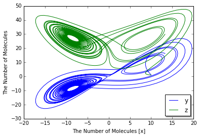
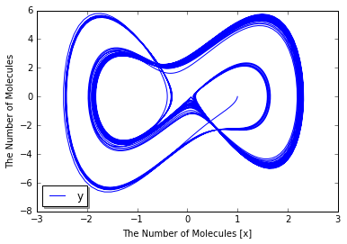

Attractors
==========

.. code:: python

    %matplotlib inline
    import numpy
    from ecell4 import *
    util.decorator.ENABLE_RATELAW = True

Rössler attractor
-----------------

.. code:: python

    a, b, c = 0.2, 0.2, 5.7
    
    with reaction_rules():
        ~x > x | (-y - z)
        ~y > y | (x + a * y)
        ~z > z | (b + z * (x - c))

.. code:: python

    run_simulation(numpy.linspace(0, 200, 4001), y0={'x': 1.0}, return_type='matplotlib',
                   opt_args={'x': 'x', 'y': ('y', 'z')})

.. image:: output_4_0.png

Modified Chua chaotic attractor
-------------------------------

.. code:: python

    alpha, beta = 10.82, 14.286
    a, b, d = 1.3, 0.1, 0.2
    
    with reaction_rules():
        h = -b * sin(numpy.pi * x / (2 * a) + d)
        ~x > x | (alpha * (y - h))
        ~y > y | (x - y + z)
        ~z > z | (-beta * y)

.. code:: python

    run_simulation(numpy.linspace(0, 250, 5001),
                   y0={'x': 0, 'y': 0.49899, 'z': 0.2}, return_type='matplotlib',
                   opt_args={'x': 'x', 'y': 'y'})

.. image:: output_7_0.png

Lorenz system
-------------

.. code:: python

    p, r, b = 10, 28, 8.0 / 3
    
    with reaction_rules():
        ~x > x | (-p * x + p * y)
        ~y > y | (-x * z + r * x - y)
        ~z > z | (x * y - b * z)

.. code:: python

    run_simulation(numpy.linspace(0, 25, 2501),
                   y0={'x': 10, 'y': 1, 'z': 1}, return_type='matplotlib',
                   opt_args={'x': 'x', 'y': ('y', 'z')})

Tamari attractor
----------------

.. code:: python

    a = 1.013
    b = -0.021
    c = 0.019
    d = 0.96
    e = 0
    f = 0.01
    g = 1
    u = 0.05
    i = 0.05
    
    with reaction_rules():
        ~x > x | ((x - a * y) * cos(z) - b * y * sin(z))
        ~y > y | ((x + c * y) * sin(z) + d * y * cos(z))
        ~z > z | (e + f * z + g * a * atan((1 - u) / (1 - i) * x * y))

.. code:: python

    run_simulation(numpy.linspace(0, 800, 8001),
                   y0={'x': 0.9, 'y': 1, 'z': 1}, return_type='matplotlib',
                   opt_args={'x': 'x', 'y': ('y', 'z')})

.. image:: output_13_0.png

Moore-Spiegel attractor
-----------------------

.. code:: python

    T, R = 6, 20
    with reaction_rules():
        ~x > x | y
        ~y > y | z
        ~z > z | (-z - (T - R + R * x * x) * y - T * x)

.. code:: python

    run_simulation(numpy.linspace(0, 100, 5001),
                   y0={'x': 1, 'y': 0, 'z': 0}, return_type='matplotlib',
                   opt_args={'x': 'x', 'y': 'y'})

