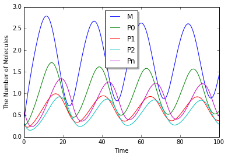
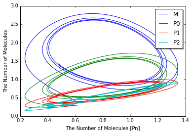

Drosophila Circadian Clock
==========================

This is a model of the oscillating Drosophila period protein(PER). This
model is based on the model introduced in the following publication.

-  A. Goldbeter, "A model for circadian oscillations in the Drosophila
   period protein(PER)", Proc R Soc Lond B Biol Sci, Vol.261:319-324,
   Sep 1995.

.. code:: python

    %matplotlib inline
    import numpy
    from ecell4 import *
    util.decorator.ENABLE_RATELAW = True

.. code:: python

    with reaction_rules():
        ~M > M | 0.76 / (1 + Pn ** 3)
        M > ~M | 0.65 * M / (0.5 + M)
        ~P0 > P0 | 0.38 * M
        P0 == P1 | (3.2 * P0 / (2 + P0), 1.58 * P1 / (2 + P1))
        P1 == P2 | (5 * P1 / (2 + P1), 2.5 * P2 / (2 + P2))
        P2 == Pn | (1.9, 1.3)
        P2 > ~P2 | 0.95 * P2 / (0.2 + P2)

.. code:: python

    y0 = {"M": 3.61328202E-01, "Pn": 6.21367E-01, "P0": 3.01106835E-01, "P1": 3.01106835E-01, "P2": 3.61328202E-01}
    obs = run_simulation(numpy.linspace(0, 100, 400), y0, return_type='observer')

.. code:: python

    viz.plot_number_observer(obs)

.. code:: python

    viz.plot_number_observer(obs, x="Pn", y=("M", "P0", "P1", "P2"))

