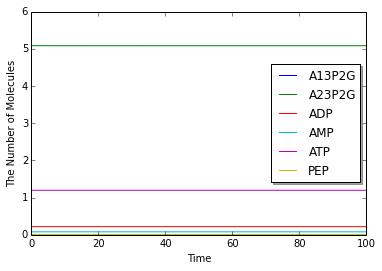

A Simple Model of the Glycolysis of Human Erythrocytes
======================================================

This is a model for the glycolysis of human erythrocytes which takes
into account ATP-synthesis and -consumption. This model is based on the
model introduced in the following publication.

-  Rapoport, T.A. and Heinrich, R. (1975) "Mathematical analysis of
   multienzyme systems. I. Modelling of the glycolysis of human
   erythrocytes.", Biosystems., 7, 1, 120-129.
-  Heinrich, R. and Rapoport, T.A. (1975) "Mathematical analysis of
   multienzyme systems. II. Steady state and transient control.",
   Biosystems., 7, 1, 130-136.

.. code:: python

    %matplotlib inline
    from ecell4 import *
    util.decorator.ENABLE_RATELAW = True

.. code:: python

    with reaction_rules():
        2 * ATP > 2 * A13P2G + 2 * ADP | (3.2 * ATP / (1.0 + (ATP / 1.0) ** 4.0))
        A13P2G > A23P2G | 1500
        A23P2G > PEP | 0.15
        A13P2G + ADP > PEP + ATP | 1.57e+4
        PEP + ADP > ATP | 559
        AMP + ATP > 2 * ADP | (1.0 * (AMP * ATP - 2.0 * ADP * ADP))
        ATP > ADP | 1.46

.. code:: python

    y0 = {"A13P2G": 0.0005082, "A23P2G": 5.0834, "PEP": 0.020502,
          "AMP": 0.080139, "ADP": 0.2190, "ATP": 1.196867}

.. code:: python

    run_simulation(100, y0=y0, return_type='matplotlib')

