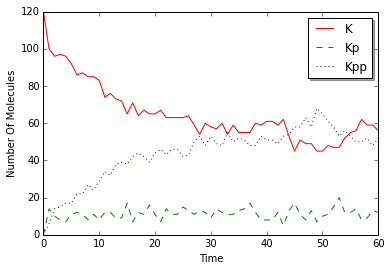

Dual Phosphorylation Cycle
==========================

.. code:: python

    from ecell4.core import *
    from ecell4.util import *

.. code:: python

    @species_attributes
    def attrgen(radius, D):
        K | {"radius": radius, "D": D}
        Kp | {"radius": radius, "D": D}
        Kpp | {"radius": radius, "D": D}
        KK | {"radius": radius, "D": D}
        PP | {"radius": radius, "D": D}
        K_KK | {"radius": radius, "D": D}
        Kp_KK | {"radius": radius, "D": D}
        Kpp_PP | {"radius": radius, "D": D}
        Kp_PP | {"radius": radius, "D": D}
    
    @reaction_rules
    def rulegen(kon1, koff1, kcat1, kon2, koff2, kcat2):
        (K + KK == K_KK | (kon1, koff1)
            > Kp + KK | kcat1
            == Kp_KK | (kon2, koff2)
            > Kpp + KK | kcat2)
    
        (Kpp + PP == Kpp_PP | (kon1, koff1)
            > Kp + PP | kcat1
            == Kp_PP | (kon2, koff2)
            > K + PP | kcat2)

.. code:: python

    m = NetworkModel()

.. code:: python

    for i, sp in enumerate(attrgen("0.0025", "1")):
        print(i, sp.serial(), sp.get_attribute("radius"), sp.get_attribute("D"))
        m.add_species_attribute(sp)

.. parsed-literal::

    (0, u'K', u'0.0025', u'1')
    (1, u'Kp', u'0.0025', u'1')
    (2, u'Kpp', u'0.0025', u'1')
    (3, u'KK', u'0.0025', u'1')
    (4, u'PP', u'0.0025', u'1')
    (5, u'K_KK', u'0.0025', u'1')
    (6, u'Kp_KK', u'0.0025', u'1')
    (7, u'Kpp_PP', u'0.0025', u'1')
    (8, u'Kp_PP', u'0.0025', u'1')

.. code:: python

    ka1, kd1, kcat1 = 0.04483455086786913, 1.35, 1.5
    ka2, kd2, kcat2 = 0.09299017957780264, 1.73, 15.0
    
    for i, rr in enumerate(rulegen(ka1, kd2, kcat1, ka2, kd2, kcat2)):
        reactants, products, k = rr.reactants(), rr.products(), rr.k()
        print(i, rr.as_string())
        m.add_reaction_rule(rr)

.. parsed-literal::

    (0, u'K+KK>K_KK|0.0448346')
    (1, u'K_KK>K+KK|1.73')
    (2, u'K_KK>Kp+KK|1.5')
    (3, u'Kp+KK>Kp_KK|0.0929902')
    (4, u'Kp_KK>Kp+KK|1.73')
    (5, u'Kp_KK>Kpp+KK|15')
    (6, u'Kpp+PP>Kpp_PP|0.0448346')
    (7, u'Kpp_PP>Kpp+PP|1.73')
    (8, u'Kpp_PP>Kp+PP|1.5')
    (9, u'Kp+PP>Kp_PP|0.0929902')
    (10, u'Kp_PP>Kp+PP|1.73')
    (11, u'Kp_PP>K+PP|15')

.. code:: python

    from ecell4.gillespie import GillespieWorld as world_type, GillespieSimulator as simulator_type
    # from ecell4.ode import ODEWorld as world_type, ODESimulator as simulator_type
    
    w = world_type(Real3(1, 1, 1))
    # w.bind_to(m)
    w.add_molecules(Species("K"), 120)
    w.add_molecules(Species("KK"), 30)
    w.add_molecules(Species("PP"), 30)
    sim = simulator_type(m, w)

.. code:: python

    obs = FixedIntervalNumberObserver(1.0, ["K", "K_KK", "Kp", "Kp_KK", "Kp_PP", "Kpp", "Kpp_PP"])
    sim.run(60, [obs])

.. code:: python

    %matplotlib inline
    import matplotlib.pylab as plt
    from numpy import array
    
    data = array(obs.data()).T
    plt.plot(data[0], data[1] + data[2], "r-", label="K")
    plt.plot(data[0], data[3] + data[4] + data[5], "g--", label="Kp")
    plt.plot(data[0], data[6] + data[7], "b:", label="Kpp")
    plt.xlabel("Time")
    plt.ylabel("Number Of Molecules")
    plt.xlim(data[0][0], data[0][-1])
    plt.legend(loc="best", shadow=True)
    plt.show()

