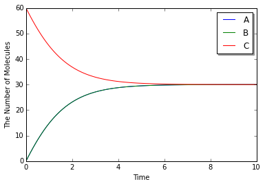
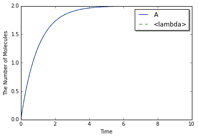

2. How to Build a Model
=======================

``Model`` is composed of a set of ``Species`` and ``ReactionRule``\ s.

-  ``Species`` describes a molecule entitie (e.g. a type or state of a
   protein) in the model. ``Species`` also has its attributes like the
   size.
-  ``ReactionRule`` describes the interactions between ``Species`` (e.g.
   binding and unbinding).

.. code:: python

    %matplotlib inline
    from ecell4 import *

2.1. Species
------------

``Species`` can be generated with its name:

.. code:: python

    sp1 = Species("A")
    print(sp1.serial())

.. parsed-literal::

    A

A name of ``Species`` (called ``serial``) has a number of naming rules.
It requires attention to use special symbols (e.g. parenthesis ``()``,
dot ``.``, underbar ``_``, numbers and brank.

``Species`` has a set of APIs for handling its attributes:

.. code:: python

    sp1.set_attribute("radius", "0.005")
    sp1.set_attribute("D", "1")
    sp1.set_attribute("location", "cytoplasm")
    print(sp1.get_attribute("radius"))
    sp1.remove_attribute("radius")
    print(sp1.has_attribute("radius"))

.. parsed-literal::

    0.005
    False

The arguments in ``set_attribute`` is the name of attribute and its
value. Both of them have to be string. There is a shortcut to set the
attributes above at once because ``radius``, ``D`` (a diffusion
coefficient) and ``location`` are frequently used.

.. code:: python

    sp1 = Species("A", "0.005", "1", "cytoplasm")  # serial, radius, D, location

The equality between ``Species`` is just evaluated based on their
serial:

.. code:: python

    print(Species("A") == Species("B"), Species("A") == Species("A"))

.. parsed-literal::

    (False, True)

A Species consists of one or more UnitSpecies:

.. code:: python

    sp1 = Species()
    usp1 = UnitSpecies("C")
    print(usp1.serial())
    sp1.add_unit(usp1)
    sp1.add_unit(UnitSpecies("A"))
    sp1.add_unit(UnitSpecies("B"))
    print(sp1.serial(), sp1.num_units())

.. parsed-literal::

    C
    (u'C.A.B', 3)

A Species can be reproduced from a serial. In a serial, all serials of
UnitSpecies are joined with the separator, dot ``.``. The comparison
between Species **matters** the oder of UnitSpecies in each Species.

.. code:: python

    sp1 = Species("C.A.B")
    print(sp1.serial())
    print(Species("A.B.C") == Species("C.A.B"))
    print(Species("A.B.C") == Species("A.B.C"))

.. parsed-literal::

    C.A.B
    False
    True

``UnitSpecies`` can have sites. Sites consists of a ``name``, ``state``
and ``bond``, and are sorted automatically in ``UnitSpecies``. ``name``
must be unique in a ``UnitSpecies``. All the value have to be string. Do
not include parenthesis, dot and blank, and not start from numbers
except for ``bond``.

.. code:: python

    usp1 = UnitSpecies("A")
    usp1.add_site("us", "u", "")
    usp1.add_site("ps", "p", "_")
    usp1.add_site("bs", "", "_")
    print(usp1.serial())

.. parsed-literal::

    A(bs^_,ps=p^_,us=u)

``UnitSpecies`` can be also reproduced from its serial. Please be
careful with the order of sites where a site with a state must be placed
after sites with no state specification:

.. code:: python

    usp1 = UnitSpecies()
    usp1.deserialize("A(bs^_, us=u, ps=p^_)")
    print(usp1.serial())

.. parsed-literal::

    A(bs^_,ps=p^_,us=u)

Of course, a site of ``UnitSpecies`` is available even in ``Species``'
serial.

.. code:: python

    sp1 = Species("A(bs^1, ps=u).A(bs, ps=p^1)")
    print(sp1.serial())
    print(sp1.num_units())

.. parsed-literal::

    A(bs^1,ps=u).A(bs,ps=p^1)
    2

The information (``UnitSpecies`` and its ``site``) is used for
rule-based modeling. The way of rule-based modeling in E-Cell4 will be
explained in `X. Introduction of Rule-based
Modeling <X.%20Introduction%20of%20Rule-based%20Modeling.ipynb>`__.

2.2. ReactionRule
-----------------

``ReactionRule`` consists of ``reactants``, ``products`` and ``k``.
``reactants`` and ``products`` are a list of ``Species``, and ``k`` is a
kinetic rate given as a floating number.

.. code:: python

    rr1 = ReactionRule()
    rr1.add_reactant(Species("A"))
    rr1.add_reactant(Species("B"))
    rr1.add_product(Species("C"))
    rr1.set_k(1.0)

Here is a binding reaction from ``A`` and ``B`` to ``C``. In this
reaction definition, you don't need to set attributes to ``Species``.
This is equivalent to call an utility function as follows:
``create_binding_reaction_rule(Species("A"), Species("B"), Species("C"), 1.0)``.

To inspect ``ReactionRule``, ``as_string`` function is available:

.. code:: python

    rr1 = create_binding_reaction_rule(Species("A"), Species("B"), Species("C"), 1.0)
    print(rr1.as_string())

.. parsed-literal::

    A+B>C|1

You can also provide components to the constructor:

.. code:: python

    rr1 = ReactionRule([Species("A"), Species("B")], [Species("C")], 1.0)
    print(rr1.as_string())

.. parsed-literal::

    A+B>C|1

In general, ``ReactionRule`` suggests a mass action reaction with rate
``k``. ``ode`` solver also supports rate laws thought it's under
development yet. ``ode.ODERatelaw`` is explained in `X. How to Solve
ODEs with Rate Law
Functions <X.%20How%20to%20Solve%20ODEs%20with%20Rate%20Law%20Functions.ipynb>`__.

2.3. NetworkModel
-----------------

Now you have known how to create components of ``Model``. Next let's
register these components to ``Model``.

.. code:: python

    sp1 = Species("A", "0.005", "1")
    sp2 = Species("B", "0.005", "1")
    sp3 = Species("C", "0.01", "0.5")

.. code:: python

    rr1 = create_binding_reaction_rule(Species("A"), Species("B"), Species("C"), 0.01)
    rr2 = create_unbinding_reaction_rule(Species("C"), Species("A"), Species("B"), 0.3)

``NetworkModel`` has interfaces to register ``Species`` and
``ReactionRule`` named ``add_species_attribute`` and
``add_reaction_rule``.

.. code:: python

    m1 = NetworkModel()
    m1.add_species_attribute(sp1)
    m1.add_species_attribute(sp2)
    m1.add_species_attribute(sp3)
    m1.add_reaction_rule(rr1)
    m1.add_reaction_rule(rr2)

Here is a simple model with binding and unbinding reactions. To inspect
``Model``, ``species_attributes`` and ``reaction_rules`` is available:

.. code:: python

    print([sp.serial() for sp in m1.species_attributes()])
    print([rr.as_string() for rr in m1.reaction_rules()])

.. parsed-literal::

    [u'A', u'B', u'C']
    [u'A+B>C|0.01', u'C>A+B|0.3']

``Species``' attributes in ``Model`` are indispensable for spatial
simulations, but not necessarily needed for non-spatial algorithms, i.e.
``gillespie`` and ``ode``. The attribute pushed first has higher
priority than one pushed later. You can also attribute a ``Species``
based on the attributes in a ``Model``.

.. code:: python

    sp1 = Species("A")
    print(sp1.has_attribute("radius"))
    sp2 = m1.apply_species_attributes(sp1)
    print(sp2.has_attribute("radius"))
    print(sp2.get_attribute("radius"))

.. parsed-literal::

    False
    True
    0.005

All functions related to ``Species``, ``ReactionRule`` and
``NetworkModel`` above are available even on C++ in the same way.

You can solve this model with ``run_simulation`` as explained in `1.
Brief Tour of E-Cell4
Simulations <1.%20Brief%20Tour%20of%20E-Cell4%20Simulations.ipynb>`__:

.. code:: python

    run_simulation(10.0, model=m1, y0={'C': 60})

2.4. Python Utilities to Build a Model
--------------------------------------

As shown in `1. Brief Tour of E-Cell4
Simulations <1.%20Brief%20Tour%20of%20E-Cell4%20Simulations.ipynb>`__,
E-Cell4 also provides the easier way to build a model using ``with``
statement:

.. code:: python

    with species_attributes():
        A | B | {'radius': '0.005', 'D': '1'}
        C | {'radius': '0.01', 'D': '0.5'}
    
    with reaction_rules():
        A + B == C | (0.01, 0.3)
    
    m1 = get_model()

For reversible reactions, ``<>`` is also available instead of ``==`` on
Python 2, but deprecated on Python3. In the ``with`` statement,
undeclared variables are automaticaly assumed to be a ``Species``. Any
Python variables, functions and statement are available even in the
``with`` block.

.. code:: python

    from math import log
    
    ka, kd, kf = 0.01, 0.3, 0.1
    tau = 10.0
    
    with reaction_rules():
        E0 + S == ES | (ka, kd)
    
        if tau > 0:
            ES > E1 + P | kf
            E1 > E0 | log(2) / tau
        else:
            ES > E0 + P | kf
    
    m1 = get_model()
    del ka, kd, kf, tau

Meanwhile, once some variable is declared even outside the block, you
can not use its name as a ``Species`` as follows:

.. code:: python

    A = 10
    
    try:
        with reaction_rules():
            A + B == C | (0.01, 0.3)
    except Exception, e:
        print(repr(e))
    
    del A

.. parsed-literal::

    RuntimeError('invalid expression; "10" given',)

where ``A + B == C`` exactly means ``10 + B == C``.

In the absence of left or right hand side of ``ReactionRule`` like
synthesis or degradation, you may want to describe like:

.. code:: python

    with reaction_rules():
        A > | 1.0  # XXX: will raise SyntaxError
        > A | 1.0  # XXX: will raise SyntaxError

However, they are not accepted because of ``SyntaxError`` on Python. To
describe these cases, a special operator, tilde ``~``, is available.
``~`` sets a stoichiometric coefficient of the following ``Species`` as
zero, which means the ``Species`` is just ignored in the
``ReactionRule``.

.. code:: python

    with reaction_rules():
        ~A > A | 2.0  # equivalent to `create_synthesis_reaction_rule`
        A > ~A | 1.0  # equivalent to `create_degradation_reaction_rule`
    
    m1 = get_model()
    print([rr.as_string() for rr in m1.reaction_rules()])

.. parsed-literal::

    [u'>A|2', u'A>|1']

The following ``Species``' name is not necessarily needed to be the same
as others. The model above describes :math:`[A]'=2-[A]`:

.. code:: python

    from math import exp
    run_simulation(10.0, model=m1, opt_args=['-', lambda t: 2.0 * (1 - exp(-t)), '--'])

A chain of serial reactions can be described in one line. To split a
line into two or more physical lines, wrap lines in a parenthesis:

.. code:: python

    with reaction_rules():
        (E + S == ES | (0.5, 1.0)
             > E + P | 1.5)
    
    m1 = get_model()
    print([rr.as_string() for rr in m1.reaction_rules()])

.. parsed-literal::

    [u'E+S>ES|0.5', u'ES>E+S|1', u'ES>E+P|1.5']

The method uses global variables in ``ecell4.util.decorator`` (e.g.
``REACTION_RULES``) to cache objects created in the ``with`` statement:

.. code:: python

    import ecell4.util.decorator
    
    with reaction_rules():
        A + B == C | (0.01, 0.3)
    
    print(ecell4.util.decorator.REACTION_RULES)  #XXX: Only for debugging
    get_model()
    print(ecell4.util.decorator.REACTION_RULES)  #XXX: Only for debugging

.. parsed-literal::

    [<ecell4.core.ReactionRule object at 0x7f14059046f0>, <ecell4.core.ReactionRule object at 0x7f14059044e0>]
    []

For the modularity in building ``Model``, decorator functions are also
usefull.

.. code:: python

    @species_attributes
    def attrgen1(radius, D):
        A | B | {'radius': str(radius), 'D': str(D)}
        C | {'radius': str(radius * 2), 'D': str(D * 0.5)}
    
    @reaction_rules
    def rrgen1(kon, koff):
        A + B == C | (kon, koff)
    
    attrs1 = attrgen1(0.005, 1)
    rrs1 = rrgen1(0.01, 0.3)
    print(attrs1)
    print(rrs1)

.. parsed-literal::

    [<ecell4.core.Species object at 0x7f14059044e0>, <ecell4.core.Species object at 0x7f1405904630>, <ecell4.core.Species object at 0x7f14059046f0>]
    [<ecell4.core.ReactionRule object at 0x7f14059044f8>, <ecell4.core.ReactionRule object at 0x7f1405904738>]

Do **not** add parenthesis after decorators in contrast to the case of
the ``with`` statement. The functions decorated by ``reaction_rules``
and ``species_attributes`` return a list of ``ReactionRule``\ s and
``Species`` respectively. The list can be registered to ``Model`` at
once by using ``add_reaction_rules`` and ``add_species_attributes``.

.. code:: python

    m1 = NetworkModel()
    m1.add_species_attributes(attrs1)
    m1.add_reaction_rules(rrs1)
    print(m1.num_reaction_rules())

.. parsed-literal::

    2

This method is modular and reusable relative to the way using ``with``
statement.
