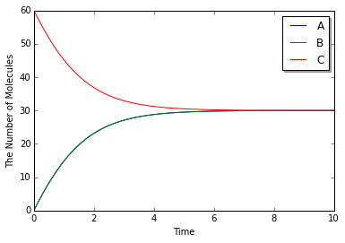
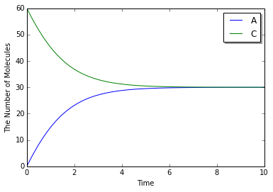
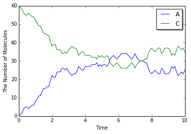

8. More about 1. Brief Tour of E-Cell4 Simulations
==================================================

Once you read through :doc:`../tutorial1/tutorial1`, it is
NOT difficult to use ``World`` and ``Simulator``. ``volume`` and
``{'C': 60}`` is equivalent of the ``World`` and solver is the
``Simulator`` below.

.. code:: python

    %matplotlib inline
    from ecell4 import *
    
    with reaction_rules():
        A + B == C | (0.01, 0.3)
    
    y = run_simulation(10.0, {'C': 60}, volume=1.0)

Here we give you a breakdown for ``run_simulation``. ``run_simulation``
use ODE simulator by default, so we create ``ODEWorld`` step by step.

Creating ODEWorld
-----------------

You can create ``World`` like this.

.. code:: python

    w = ode.ODEWorld(Real3(1, 1, 1))

``Real3`` is a coordinate vector. In this example, the first argument
for ``ODEWorld`` constructor is a cube. Note that you can NOT use volume
for ``ode.ODEWorld`` argument, like ``run_simulation`` argument.

Now you created a cube box for simulation, next let's throw molecules
into the cube.

.. code:: python

    w = ode.ODEWorld(Real3(1, 1, 1))
    w.add_molecules(Species('C'), 60)
    print(w.t(), w.num_molecules(Species('C')))  # must return (0.0, 60)

.. parsed-literal::

    (0.0, 60)

Use ``add_molecules`` to add molecules, ``remove_molecules`` to remove
molecules, ``num_molecules`` to know the number of molecules. First
argument for each method is the ``Species`` you want to know. You can
get current time by ``t`` method. However the number of molecules in ODE
solver is real number, in these ``_molecules`` functions work only for
integer number. When you handle real numbers in ODE, use ``set_value``
and ``get_value``.

How to Use Real3
----------------

Before the detail of ``Simulator``, we explaing more about ``Real3``.

.. code:: python

    pos = Real3(1, 2, 3)
    print(pos)  # must print like <ecell4.core.Real3 object at 0x7f44e118b9c0>
    print(tuple(pos))  # must print (1.0, 2.0, 3.0)

.. parsed-literal::

    <ecell4.core.Real3 object at 0x10062fb88>
    (1.0, 2.0, 3.0)

You can not print the contents in ``Real3`` object directly. You need to
convert ``Real3`` to Python tuple or list once.

.. code:: python

    pos1 = Real3(1, 1, 1)
    x, y, z = pos[0], pos[1], pos[2]
    pos2 = pos1 + pos1
    pos3 = pos1 * 3
    pos4 = pos1 / 5
    print(length(pos1))  # must print 1.73205080757
    print(dot_product(pos1, pos3))  # must print 9.0

.. parsed-literal::

    1.73205080757
    9.0

You can use basic function like ``dot_product``. Of course, you can
convert ``Real3`` to numpy array too.

.. code:: python

    import numpy
    a = numpy.asarray(tuple(Real3(1, 2, 3)))
    print(a)  # must print [ 1.  2.  3.]

.. parsed-literal::

    [ 1.  2.  3.]

``Integer3`` represents a triplet of integers.

.. code:: python

    g = Integer3(1, 2, 3)
    print(tuple(g))

.. parsed-literal::

    (1, 2, 3)

Of course, you can also apply simple arithmetics to ``Integer3``.

.. code:: python

    print(tuple(Integer3(1, 2, 3) + Integer3(4, 5, 6)))  # => (5, 7, 9)
    print(tuple(Integer3(4, 5, 6) - Integer3(1, 2, 3)))  # => (3, 3, 3)
    print(tuple(Integer3(1, 2, 3) * 2))  # => (2, 4, 6)
    print(dot_product(Integer3(1, 2, 3), Integer3(4, 5, 6)))  # => 32
    print(length(Integer3(1, 2, 3)))  # => 3.74165738677

.. parsed-literal::

    (5, 7, 9)
    (3, 3, 3)
    (2, 4, 6)
    32
    3.74165738677

Creating and Running ODESimulator
---------------------------------

You can create a ``Simulator`` with ``Model`` and ``World`` like

.. code:: python

    with reaction_rules():
        A + B > C | 0.01  # equivalent to create_binding_reaction_rule
        C > A + B | 0.3   # equivalent to create_unbinding_reaction_rule
    
    m = get_model()
    
    sim = ode.ODESimulator(m, w)
    sim.run(10.0)

then call ``run`` method, the simulation will run. In this example the
simulation runs for 10seconds.

You can check the state of the ``World`` like this.

.. code:: python

    print(w.t(), w.num_molecules(Species('C')))  # must return (10.0, 30)

.. parsed-literal::

    (10.0, 30)

You can see that the number of the ``Species`` ``C`` decreases from 60
to 30.

``World`` describes the state of a timepoint, so you can NOT see the
transition of the simulation with the ``World``. To obtain the
time-series result, use ``Observer``.

.. code:: python

    w = ode.ODEWorld(Real3(1, 1, 1))
    w.add_molecules(Species('C'), 60)
    sim = ode.ODESimulator(m, w)
    
    obs = FixedIntervalNumberObserver(0.1, ('A', 'C'))
    sim.run(10.0, obs)
    print(obs.data())  # must return [[0.0, 0.0, 60.0], ..., [10.0, 29.994446899691276, 30.005553100308752]]

.. parsed-literal::

    [[0.0, 0.0, 60.0], [0.1, 1.7722206098711988, 58.227779390128795], [0.2, 3.4860124889661757, 56.51398751103382], [0.30000000000000004, 5.1376332715496495, 54.862366728450354], [0.4, 6.724090809612153, 53.27590919038786], [0.5, 8.243129756755453, 51.75687024324456], [0.6000000000000001, 9.69320376680592, 50.3067962331941], [0.7000000000000001, 11.073435590968808, 48.92656440903121], [0.8, 12.383567691608423, 47.616432308391595], [0.9, 13.62390591657045, 46.37609408342957], [1.0, 14.795258681171735, 45.20474131882829], [1.1, 15.898873899780316, 44.10112610021971], [1.2000000000000002, 16.936375633755194, 43.06362436624483], [1.3, 17.90970211303103, 42.090297886969], [1.4000000000000001, 18.821046466966358, 41.17895353303366], [1.5, 19.67280118133671, 40.32719881866331], [1.6, 20.46750699887015, 39.53249300112988], [1.7000000000000002, 21.207806714875233, 38.792193285124796], [1.8, 21.896404094818397, 38.10359590518163], [1.9000000000000001, 22.536027939969333, 37.463972060030684], [2.0, 23.129401186565122, 36.8705988134349], [2.1, 23.679214801318086, 36.320785198681946], [2.2, 24.188106157761755, 35.81189384223828], [2.3000000000000003, 24.658641522840725, 35.34135847715931], [2.4000000000000004, 25.093302252968826, 34.9066977470312], [2.5, 25.49447428958285, 34.50552571041718], [2.6, 25.86444054777012, 34.13555945222991], [2.7, 26.205375806607968, 33.79462419339207], [2.8000000000000003, 26.51934373464207, 33.48065626535796], [2.9000000000000004, 26.80829570797557, 33.19170429202446], [3.0, 27.07407111744664, 32.92592888255339], [3.1, 27.318398885233666, 32.68160111476636], [3.2, 27.542899949227504, 32.457100050772524], [3.3000000000000003, 27.749090501388586, 32.25090949861144], [3.4000000000000004, 27.938385796523626, 32.0616142034764], [3.5, 28.112104375214862, 31.88789562478517], [3.6, 28.271472567998387, 31.728527432001645], [3.7, 28.417629170003387, 31.582370829996645], [3.8000000000000003, 28.551630196373424, 31.44836980362661], [3.9000000000000004, 28.674453642480778, 31.32554635751925], [4.0, 28.787004191633095, 31.212995808366934], [4.1000000000000005, 28.890117821767866, 31.109882178232162], [4.2, 28.984566277309003, 31.015433722691025], [4.3, 29.071061377146354, 30.928938622853675], [4.4, 29.150259141926327, 30.8497408580737], [4.5, 29.22276372627192, 30.777236273728107], [4.6000000000000005, 29.289131148912805, 30.710868851087223], [4.7, 29.349872817459094, 30.650127182540935], [4.800000000000001, 29.405458847152726, 30.594541152847302], [4.9, 29.456321176884504, 30.543678823115524], [5.0, 29.50285648638057, 30.49714351361946], [5.1000000000000005, 29.545428921493947, 30.45457107850608], [5.2, 29.58437263404594, 30.415627365954087], [5.300000000000001, 29.61999414522251, 30.38000585477752], [5.4, 29.652574540327944, 30.347425459672085], [5.5, 29.682371504475235, 30.317628495524794], [5.6000000000000005, 29.70962120751236, 30.29037879248767], [5.7, 29.734540047958276, 30.265459952041752], [5.800000000000001, 29.757326264061593, 30.242673735938435], [5.9, 29.778161421010864, 30.221838578989164], [6.0, 29.797211782455758, 30.20278821754427], [6.1000000000000005, 29.814629574218237, 30.18537042578179], [6.2, 29.8305541480645, 30.169445851935528], [6.300000000000001, 29.84511305246321, 30.15488694753682], [6.4, 29.858423017246, 30.141576982754028], [6.5, 29.87059085870597, 30.129409141294058], [6.6000000000000005, 29.881714310971407, 30.11828568902862], [6.7, 29.89188278945169, 30.10811721054834], [6.800000000000001, 29.90117809152673, 30.098821908473298], [6.9, 29.90967503947212, 30.09032496052791], [7.0, 29.917442070090726, 30.082557929909303], [7.1000000000000005, 29.92454177537786, 30.075458224622167], [7.2, 29.931031398107503, 30.068968601892525], [7.300000000000001, 29.936963286002193, 30.063036713997835], [7.4, 29.942385307810326, 30.057614692189702], [7.5, 29.947341234455514, 30.052658765544514], [7.6000000000000005, 29.951871088073982, 30.048128911926046], [7.7, 29.956011461640173, 30.043988538359855], [7.800000000000001, 29.959795811548137, 30.04020418845189], [7.9, 29.963254725453346, 30.036745274546682], [8.0, 29.966416167388665, 30.033583832611363], [8.1, 29.969305702114955, 30.030694297885073], [8.200000000000001, 29.971946700366555, 30.028053299633473], [8.3, 29.97436052665158, 30.02563947334845], [8.4, 29.9765667110567, 30.023433288943327], [8.5, 29.978583106421084, 30.021416893578944], [8.6, 29.98042603207785, 30.019573967922177], [8.700000000000001, 29.982110405343864, 30.017889594656165], [8.8, 29.983649861761148, 30.01635013823888], [8.9, 29.985056865065513, 30.014943134934516], [9.0, 29.98634280775227, 30.01365719224776], [9.1, 29.9875181030258, 30.01248189697423], [9.200000000000001, 29.988592268884133, 30.011407731115895], [9.3, 29.98957400499266, 30.010425995007367], [9.4, 29.990471262976794, 30.009528737023235], [9.5, 29.99129131068186, 30.00870868931817], [9.600000000000001, 29.992040790927835, 30.007959209072194], [9.700000000000001, 29.99272577521901, 30.007274224781018], [9.8, 29.993351812847337, 30.00664818715269], [9.9, 29.993923975779538, 30.00607602422049], [10.0, 29.994446899691276, 30.005553100308752]]

There are several types of ``Observer``\ s for E-Cell4.
``FixedIntervalNumberObserver`` is the simplest ``Observer`` to obtain
the time-series result. As its name suggests, this ``Observer`` records
the number of molecules for each time-step. The 1st argument is the
time-step, the 2nd argument is the molecule types. You can check the
result with ``data`` method, but there is a shortcut for this.

.. code:: python

    viz.plot_number_observer(obs)

This plots the time-series result easily.

We explained the internal of ``run_simulation`` function. When you
change the ``World`` after creating the ``Simulator``, you need to
indicate it to ``Simulator``. So do NOT forget to call
``sim.initialize()`` after that.

Switching the Solver
--------------------

It is NOT difficult to switch the solver to stochastic method, as we
showed ``run_simulation``.

.. code:: python

    from ecell4 import *
    
    with reaction_rules():
        A + B == C | (0.01, 0.3)
    
    m = get_model()
    
    # ode.ODEWorld -> gillespie.GillespieWorld
    w = gillespie.GillespieWorld(Real3(1, 1, 1))
    w.add_molecules(Species('C'), 60)
    
    # ode.ODESimulator -> gillespie.GillespieSimulator
    sim = gillespie.GillespieSimulator(m, w)
    obs = FixedIntervalNumberObserver(0.1, ('A', 'C'))
    sim.run(10.0, obs)
    
    viz.plot_number_observer(obs)

``World`` and ``Simulator`` never change the ``Model`` itself, so you
can switch several ``Simulator``\ s for 1 ``Model``.
