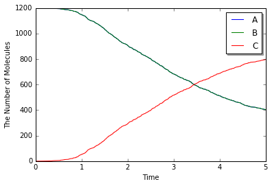
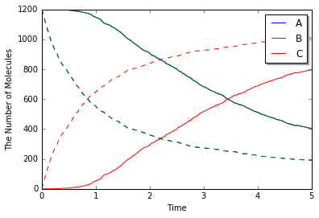

9. Spatial Gillespie Method
===========================

9.1. Spaces in E-Cell4
----------------------

What the space in E-Cell4 looks like?

.. code:: python

    from ecell4 import *
    
    w1 = ode.ODEWorld(Real3(1, 1, 1))
    w2 = gillespie.GillespieWorld(Real3(1, 1, 1))

We created a cube size, ``1``, on a side for ``ODEWorld`` and
``GillespieWorld``. In this case the volume only matters, that is

.. code:: python

    w3 = ode.ODEWorld(Real3(2, 0.5, 1))  # is almost equivalent to 'w1'
    w4 = gillespie.GillespieWorld(Real3(2, 2, 0.25))  # is almost equivalent to 'w2'

This returns the same results. Because the volume is same as ``1``.

This seems reasonable in homogeneous system, but the cell is NOT
homogeneous. So we need to consider a space for molecular localization.

You can use several types of space and simulation methods in E-Cell4. We
show an example with spatial Gillespie method here.

9.2. Spatial Gillespie Method
-----------------------------

In E-Cell4, the Spatial Gillespie method is included in ``meso`` module.
Let's start with ``run_simulation`` like ``ode``.

.. code:: python

    %matplotlib inline
    import numpy
    from ecell4 import *
    
    with reaction_rules():
        A + B == C | (0.01, 0.3)
    
    y = run_simulation(numpy.linspace(0, 10, 100), {'C': 60}, solver='meso')

.. parsed-literal::

    /Users/knishida/Library/Python/2.7/lib/python/site-packages/matplotlib/font_manager.py:273: UserWarning: Matplotlib is building the font cache using fc-list. This may take a moment.
      warnings.warn('Matplotlib is building the font cache using fc-list. This may take a moment.')

.. image:: output_6_1.png

At the steady state, the number of ``C`` is given as follows:

.. math::

   \frac{d\mathrm{C}}{dt}=0.01{\cdot}\frac{\mathrm{A}}{V}{\cdot}\frac{\mathrm{B}}{V}-0.3{\cdot}\frac{\mathrm{C}}{V}=0\\
   0.01\left(60-\mathrm{C}\right)^2=0.3\mathrm{C}\times V\\
   \mathrm{C}=30.

You will obtain almost the same result with ``ode`` or ``gillespie``
(may take longer time than ``ode`` or ``gillespie``). This is not
surprising because ``meso`` module is almost same with Gillespie unless
you give additional spatial parameter.

Next we will decompose ``run_simulation``.

.. code:: python

    from ecell4 import *
    
    with reaction_rules():
        A + B == C | (0.01, 0.3)
    
    m = get_model()
    
    w = meso.MesoscopicWorld(Real3(1, 1, 1), Integer3(1, 1, 1))  # XXX: Point2
    w.bind_to(m)  # XXX: Point1
    w.add_molecules(Species('C'), 60)
    
    sim = meso.MesoscopicSimulator(w)  # XXX: Point1
    obs = FixedIntervalNumberObserver(0.1, ('A', 'B', 'C'))
    sim.run(10, obs)
    
    viz.plot_number_observer(obs)

.. image:: output_9_0.png

This is nothing out of the ordinary one except for ``MesoscopicWorld``
and ``MesoscopicSimulator``, but you can see some new elements.

First in ``w.bind_to(m)`` we asscociated a ``Model`` to the ``World``.
In the basic exercises before, we did NOT do this. In spatial methods,
``Species`` attributes are necessary. Do not forget to call this. After
that, only the ``World`` is required to create a
``MesoscopicSimulator``.

Next, the important difference is the second argument for
MesoscopicWorld, i.e. ``Integer3(1, 1, 1)``. ``ODEWorld`` and
``GillespieWorld`` do NOT have this second argument. Before we explain
this, let's change this argument and run the simulation again.

.. code:: python

    from ecell4 import *
    
    with reaction_rules():
        A + B == C | (0.01, 0.3)
    
    m = get_model()
    
    w = meso.MesoscopicWorld(Real3(1, 1, 1), Integer3(4, 4, 4))  # XXX: Point2
    w.bind_to(m)  # XXX: Point1
    w.add_molecules(Species('C'), 60)
    
    sim = meso.MesoscopicSimulator(w)  # XXX: Point1
    obs = FixedIntervalNumberObserver(0.1, ('A', 'B', 'C'))
    sim.run(10, obs)
    
    viz.plot_number_observer(obs)

.. image:: output_11_0.png

| You must have the different plot. If you increase value in the
  ``Integer3``, you will have more different one.
| Actually this second argument means the number of spatical partitions.
  ``meso`` is almost same with ``gillespie``, but ``meso`` divides the
  space into cuboids (we call these cuboids subvolumes) and each
  subvolume has different molecular concentration by contrast
  ``gillespie`` has only one uniform closed space. So in the preceding
  example, we divided ``1`` cube with sides ``1`` into ``64`` (4x4x4)
  cubes with sides ``0.25``. We threw 60 ``C`` molecules into the
  ``World``. Thus, each ``subvolume`` has 1 species at most.

9.3. Defining Molecular Diffusion Coefficient
---------------------------------------------

Where the difference is coming from? This is because we do NOT consider
molecular diffusion coefficient, although we got a space with ``meso``.
To setup diffusion coefficient, use ``Species`` attribute ``'D'`` in the
way described before (`2. How to Build a
Model <2.%20How%20to%20Build%20a%20Model.ipynb>`__). As shown in `1.
Brief Tour of E-Cell4
Simulations <1.%20Brief%20Tour%20of%20E-Cell4%20Simulations.ipynb>`__,
we use E-Cell4 special notation here.

.. code:: python

    with species_attributes():
        A | {'D': '1'}
        B | {'D': '1'}
        C | {'D': '1'}
    
        # A | B | C | {'D': '1'}  # means the same as above
    
    get_model()

.. parsed-literal::

    <ecell4.core.NetworkModel at 0x10cddd2d0>

You can setup diffusion coefficient with ``with species_attributes():``
statement. Here we set all the diffusion coefficient as ``1``. Let's
simulate this model again. Now you must have the almost same result with
``gillespie`` even with large ``Integer3`` value (the simulation will
takes much longer than ``gillespie``).

How did the molecular diffusion work for the problem? Think about free
diffusion (the diffusion coefficient of a Species is :math:`D`) in 3D
space. The unit of diffusion coefficient is the square of length divided
by time like :math:`\mathrm{\mu m}^2/s` or :math:`\mathrm{nm}^2/\mu s`.

It is known that the average of the square of point distance from time
:math:`0` to :math:`t` is equal to :math:`6Dt`. Conversely the average
of the time scale in a space with length scale :math:`l` is about
:math:`l^2/6D`.

In the above case, the size of each subvolume is 0.25 and the diffusion
coefficient is 1. Thus the time scale is about 0.01 sec. If the
molecules of the ``Species`` ``A`` and ``B`` are in the same subvolume,
it takes about 1.5 sec to react, so in most cases the diffusion is
faster than the reaction and the molecules move to other subvolume even
dissociated in the same subvolume. The smaller :math:`l`, the smaller
subvolume's volume :math:`l^3`, so the reaction rate after dissociation
is faster, and the time of the diffusion and the transition between the
subvolume gets smaller too.

9.4. Molecular localization
---------------------------

We have used ``add_molecules`` function to add molecules to ``World`` in
the same manner as ``ode`` or ``gillespie``. Meanwhile in
``MesoscopicWorld``, you can put in molecules according to the spatial
presentation.

.. code:: python

    from ecell4 import *
    
    w = meso.MesoscopicWorld(Real3(1, 1, 1), Integer3(3, 3, 3))
    w.add_molecules(Species('A'), 120)
    w.add_molecules(Species('B'), 120, Integer3(1, 1, 1))

In ``MesoscopicWorld``, you can set the subvolume and the molecule
locations by giving the third argument ``Integer3`` to
``add_molecules``. In the above example, the molecule type ``A`` spreads
all over the space, but the molecule type ``B`` only locates in a
subvolume at the center of the volume. To check this, use
``num_molecules`` function with a coordinate.

.. code:: python

    print(w.num_molecules(Species('B')))  # must print 120
    print(w.num_molecules(Species('B'), Integer3(0, 0, 0)))  # must print 0
    print(w.num_molecules(Species('B'), Integer3(1, 1, 1)))  # must print 120

.. parsed-literal::

    120
    0
    120

Furthermore, if you have IPython Notebook environment, you can visualize
the molecular localization with ``ecell4.viz`` module.

.. code:: python

    # viz.plot_world(w, radius=0.01)
    viz.plot_world(w, interactive=False)

.. image:: output_22_0.png

``viz.plot_world`` function visualize the location of the molecules in
IPython Notebook cell by giving the ``World``. You can set the molecule
size with ``radius``. Now you can set the molecular localization to the
``World``, next let's simulate this. In the above example, we set the
diffusion coefficient 1 and the World side 1, so 10 seconds is enough to
stir this. After the simulation, check the result with calling
``viz.plot_world`` again.

9.5. Molecular initial location and the reaction
------------------------------------------------

This is an extreme example to check how the molecular localization
affects the reaction.

.. code:: python

    %matplotlib inline
    from ecell4 import *
    
    with species_attributes():
        A | B | C | {'D': '1'}
    
    with reaction_rules():
        A + B > C | 0.01
    
    m = get_model()
    w = meso.MesoscopicWorld(Real3(10, 1, 1), Integer3(10, 1, 1))
    w.bind_to(m)

This model consists only of a simple binding reaction. The ``World`` is
a long x axis cuboid, and molecules are located off-center.

.. code:: python

    w.add_molecules(Species('A'), 1200, Integer3(2, 0, 0))
    w.add_molecules(Species('B'), 1200, Integer3(7, 0, 0))
    # viz.plot_world(w, radius=0.025)
    viz.plot_world(w, interactive=False)

.. image:: output_27_0.png

On a different note, there is a reason not to set ``Integer3(0, 0, 0)``
or ``Integer3(9, 0, 0)``. In E-Cell4, basically we adopt periodic
boundary condition for everything. So the forementioned two subvolumes
are actually adjoining.

After realizing the location expected, simulate it with
``MesoscopicSimulator``.

.. code:: python

    sim = meso.MesoscopicSimulator(w)
    obs1 = NumberObserver(('A', 'B', 'C'))  # XXX: saves the numbers after every steps
    sim.run(5, obs1)
    viz.plot_number_observer(obs1)

.. code:: python

    # viz.plot_world(w, radius=0.025)
    viz.plot_world(w, interactive=False)

.. image:: output_30_0.png

To check the effect of initial coordinates, we recommend that you locate
the molecules homogeneously with ``meso`` or simulate with
``gillespie``.

.. code:: python

    w = meso.MesoscopicWorld(Real3(10, 1, 1), Integer3(10, 1, 1))
    w.bind_to(m)
    w.add_molecules(Species('A'), 1200)
    w.add_molecules(Species('B'), 1200)
    
    sim = meso.MesoscopicSimulator(w)
    obs2 = NumberObserver(('A', 'B', 'C'))  # XXX: saves the numbers after every steps
    sim.run(5, obs2)
    viz.plot_number_observer(obs1, "-", obs2, "--")

The solid line is biased case, and the dash line is non-biased. The
biased reaction is obviously slow. And you may notice that the shape of
time-series is also different between the solid and dash lines. This is
because it takes some time for the molecule ``A`` and ``B`` to collide
due to the initial separation. Actually it takes
:math:`4^2/2(D_\mathrm{A}+D_\mathrm{B})=4` seconds to move the initial
distance between ``A`` and ``B`` (about 4).

