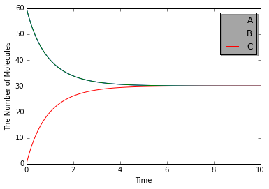

# Tutorials

The Tutorial is divided in three sections: Basic, Topical and Advanced exercises. We recommend to try all Basic exercises to understand how to use E-Cell4. Each section contains several IPython notebooks with different exercises. 

Get started with E-Cell4 by going through the tutorial.

## Basic Exercises

There are three important components to understand E-Cell4: `Model`, `World` and `Simulator` classes. These components describe different concepts in a simulation.

`Model`, as its name suggests, describes the matter to simulate.  
`World` describes the state. For example, initial state or a state of a time-point.  
`Simulator` describes the solver and algorithm.

These three components are independent, but `World` is often dependent on a type of `Simulator`.

- [Model](http://nbviewer.ipython.org/github/ecell/ecell4/blob/develop/ipynb/Tutorials/ModelBasics.ipynb)
- [World and Simulator](http://nbviewer.ipython.org/github/ecell/ecell4/blob/develop/ipynb/Tutorials/WorldSimBasics.ipynb)

## Topical Exercises

- [Visualizer](http://nbviewer.ipython.org/github/ecell/ecell4/blob/develop/ipynb/Tutorials/Visualizer.ipynb)
- [Rule-based Modeling](http://nbviewer.ipython.org/github/ecell/ecell4/blob/develop/ipynb/Tutorials/RuleBasedModeling.ipynb)
- [Observer](http://nbviewer.ipython.org/github/ecell/ecell4/blob/develop/ipynb/Tutorials/Observer.ipynb)

## Advanced Exercises

- [World Advanced](http://nbviewer.ipython.org/github/ecell/ecell4/blob/develop/ipynb/Tutorials/WorldAdvanced.ipynb)
- [Model Advanced](http://nbviewer.ipython.org/github/ecell/ecell4/blob/develop/ipynb/Tutorials/ModelAdvanced.ipynb)
- [Simple equilibrium model](http://nbviewer.ipython.org/github/ecell/ecell4/blob/develop/ipynb/Tutorials/SimpleEquilibrium.ipynb)

## Example

Here is an extremely simple example with a reversible binding reaction:

    %matplotlib inline
    import numpy
    from ecell4 import *
    
    with reaction_rules():
        A + B == C | (0.01, 0.3)
    
    y = run_simulation(
        numpy.linspace(0, 10, 100), {'A': 60, 'B': 60}, solver='ode')

More examples are available below:

- [MSD](http://nbviewer.ipython.org/github/ecell/ecell4/blob/develop/ipynb/Examples/MSD.ipynb) explains how to take statistics of trajectories of particles freely diffusing in three-dimensional space. This would be the best demonstration to explain the usage of `FixedIntervalTrajectoryObserver`.

## [Introduction](http://nbviewer.ipython.org/github/ecell/ecell4/blob/develop/ipynb/Tutorials/Introduction.ipynb)
- [E-Cell4 fundamental components](http://nbviewer.ipython.org/github/ecell/ecell4/blob/develop/ipynb/Tutorials/Introduction.ipynb#E-Cell4-fundamental-components)
- [A basic model in E-Cell 4](http://nbviewer.ipython.org/github/ecell/ecell4/blob/develop/ipynb/Tutorials/Introduction.ipynb#A-basic-model-in-E-Cell-4)
  - [Species](http://nbviewer.ipython.org/github/ecell/ecell4/blob/develop/ipynb/Tutorials/Introduction.ipynb#Species)
  - [ReactionRule](http://nbviewer.ipython.org/github/ecell/ecell4/blob/develop/ipynb/Tutorials/Introduction.ipynb#ReactionRule)
  - [NetworkModel](http://nbviewer.ipython.org/github/ecell/ecell4/blob/develop/ipynb/Tutorials/Introduction.ipynb#NetworkModel)
- [A simple simulation with E-Cell4](http://nbviewer.ipython.org/github/ecell/ecell4/blob/develop/ipynb/Tutorials/Introduction.ipynb#A-simple-simulation-with-E-Cell4)
- [Special model notation in E-Cell4](http://nbviewer.ipython.org/github/ecell/ecell4/blob/develop/ipynb/Tutorials/Introduction.ipynb#Special-model-notation-in-E-Cell4)
  - [Notations about synthesis and degradation](http://nbviewer.ipython.org/github/ecell/ecell4/blob/develop/ipynb/Tutorials/Introduction.ipynb#Notations-about-synthesis-and-degradation)

## [World and Simulator with ODE solver](http://nbviewer.ipython.org/github/ecell/ecell4/blob/develop/ipynb/Tutorials/WorldSimBasics.ipynb)
- [Creating ODE world](http://nbviewer.ipython.org/github/ecell/ecell4/blob/develop/ipynb/Tutorials/WorldSimBasics.ipynb#Creating-ODE-world)
- [How to use Real3](http://nbviewer.ipython.org/github/ecell/ecell4/blob/develop/ipynb/Tutorials/WorldSimBasics.ipynb#How-to-use-Real3)
- [Creating and Running ODESimulator](http://nbviewer.ipython.org/github/ecell/ecell4/blob/develop/ipynb/Tutorials/WorldSimBasics.ipynb#Creating-and-Running-ODESimulator)
- [Switching the solver](http://nbviewer.ipython.org/github/ecell/ecell4/blob/develop/ipynb/Tutorials/WorldSimBasics.ipynb#Switching-the-solver)

## [Meso](http://nbviewer.ipython.org/github/ecell/ecell4/blob/develop/ipynb/Tutorials/Meso.ipynb)
- [Space in E-Cell4](http://nbviewer.ipython.org/github/ecell/ecell4/blob/develop/ipynb/Tutorials/Meso.ipynb#Space-in-E-Cell4)
- [Spatial Gillespie method](http://nbviewer.ipython.org/github/ecell/ecell4/blob/develop/ipynb/Tutorials/Meso.ipynb#Spatial-Gillespie-method)
- [Defining molecular diffusion coefficient](http://nbviewer.ipython.org/github/ecell/ecell4/blob/develop/ipynb/Tutorials/Meso.ipynb#Defining-molecular-diffusion-coefficient)
- [Molecular localization](http://nbviewer.ipython.org/github/ecell/ecell4/blob/develop/ipynb/Tutorials/Meso.ipynb#Molecular-localization)
- [Molecular initial location and the reaction](http://nbviewer.ipython.org/github/ecell/ecell4/blob/develop/ipynb/Tutorials/Meso.ipynb#Molecular-initial-location-and-the-reaction)

## [Spatiocyte simulations with single-molecule resolution](http://nbviewer.ipython.org/github/ecell/ecell4/blob/develop/ipynb/Tutorials/Spatiocyte.ipynb)
- [Spatiocyte lattice-based method](http://nbviewer.ipython.org/github/ecell/ecell4/blob/develop/ipynb/Tutorials/Spatiocyte.ipynb#Spatiocyte-lattice-based-method)
- [The diffusion movement of single molecule](http://nbviewer.ipython.org/github/ecell/ecell4/blob/develop/ipynb/Tutorials/Spatiocyte.ipynb#The-diffusion-movement-of-single-molecule)
- [The diffusion coefficient and the second-order reaction](http://nbviewer.ipython.org/github/ecell/ecell4/blob/develop/ipynb/Tutorials/Spatiocyte.ipynb#The-diffusion-coefficient-and-the-second-order-reaction)
- [The structure in the Spatiocyte method](http://nbviewer.ipython.org/github/ecell/ecell4/blob/develop/ipynb/Tutorials/Spatiocyte.ipynb#The-structure-in-the-Spatiocyte-method)
- [The structure and the reaction](http://nbviewer.ipython.org/github/ecell/ecell4/blob/develop/ipynb/Tutorials/Spatiocyte.ipynb#The-structure-and-the-reaction)
