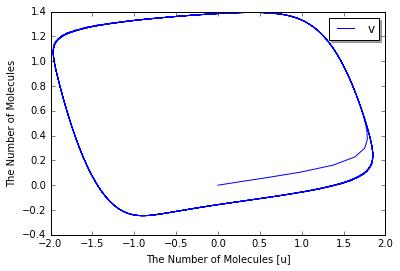

Hodgkin-Huxley Model
====================

-  A.L. Hodgkin, A.F. Huxley, "A quantitative description of membrane
   current and its application to conduction and excitation in nerve",
   J. Physiol., 117, 500-544, 1952.

.. code:: python

    %matplotlib inline
    import numpy as np
    from ecell4 import *

.. code:: python

    Q10 = 3.0
    GNa = 120.0 # mS/cm^2
    GK = 36.0 # mS/cm^2
    gL = 0.3 # mS/cm^2
    EL = -64.387 # mV
    ENa = 40.0 # mV
    EK = -87.0 # mV
    Cm = 1.0 # uF/cm^2
    
    T = 6.3 # degrees C
    Iext = 10.0 # nA
    
    with reaction_rules():
        Q = Q10 ** ((T - 6.3) / 10)
    
        alpha_m = -0.1 * (Vm + 50) / (exp(-(Vm + 50) / 10) - 1)
        beta_m = 4 * exp(-(Vm + 75) / 18)
        ~m > m | Q * (alpha_m * (1 - m) - beta_m * m)
    
        alpha_h = 0.07 * exp(-(Vm + 75) / 20)
        beta_h = 1.0 / (exp(-(Vm + 45) / 10) + 1)
        ~h > h | Q * (alpha_h * (1 - h) - beta_h * h)
    
        alpha_n = -0.01 * (Vm + 65) / (exp(-(Vm + 65) / 10) - 1)
        beta_n = 0.125 * exp(-(Vm + 75) / 80)    
        ~n > n | Q * (alpha_n * (1 - n) - beta_n * n)
    
        gNa = (m ** 3) * h * GNa
        INa = gNa * (Vm - ENa)
        gK = (n ** 4) * GK
        IK = gK * (Vm - EK)
        IL = gL * (Vm - EL)
        ~Vm > Vm | (Iext - (IL + INa + IK)) / Cm
    
    hhm = get_model()

.. code:: python

    for rr in hhm.reaction_rules():
        print(rr.as_string())

.. parsed-literal::

    Vm>m+Vm|(1.0*((((-0.1*(Vm+50))/(exp((-(Vm+50)/10))-1))*(1-m))-(4*exp((-(Vm+75)/18))*m)))
    Vm>h+Vm|(1.0*((0.07*exp((-(Vm+75)/20))*(1-h))-((1.0/(exp((-(Vm+45)/10))+1))*h)))
    Vm>n+Vm|(1.0*((((-0.01*(Vm+65))/(exp((-(Vm+65)/10))-1))*(1-n))-(0.125*exp((-(Vm+75)/80))*n)))
    m+h+n>Vm+m+h+n|((10.0-((0.3*(Vm--64.387))+((m**3)*h*120.0*(Vm-40.0))+((n**4)*36.0*(Vm--87.0))))/1.0)

.. code:: python

    run_simulation(np.linspace(0, 100, 1001), model=hhm, y0={'Vm': -75}, species_list=['Vm'])

.. image:: output_4_0.png

FitzHugh–Nagumo Model
=====================

-  R. FitzHugh, "Mathematical models of threshold phenomena in the nerve
   membrane.", Bull. Math. Biophysics, 17:257—278, 1955.

.. code:: python

    a = 0.7
    b = 0.8
    c = 12.5
    Iext = 0.5
    
    with reaction_rules():
        ~u > u | -v + u - (u ** 3) / 3 + Iext
        ~v > v | (u - b * v + a) / c
    
    fnm = get_model()

.. code:: python

    for rr in fnm.reaction_rules():
        print(rr.as_string())

.. parsed-literal::

    v>u+v|(((-v+u)-((u**3)/3))+0.5)
    u>v+u|(((u-(0.8*v))+0.7)/12.5)

.. code:: python

    run_simulation(np.linspace(0, 200, 501), model=fnm)

.. image:: output_8_0.png

.. code:: python

    run_simulation(np.linspace(0, 200, 501), model=fnm, # return_type='nyaplot',
                   opt_kwargs={'x': 'u', 'y': ['v']})

