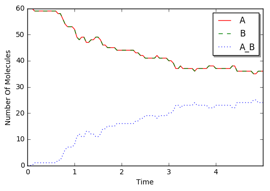

Simple Equilibrium
==================

This is a simple equilibrium model as an example. Here, we explain how
to model and run a simulation without using decorators
(``species_attributes`` and ``reaction_rules``) and ``run_simulation``
method.

.. code:: ipython2

    %matplotlib inline
    from ecell4 import *

Choose one module from a list of methods supported on E-Cell4.

.. code:: ipython2

    # f = gillespie.GillespieFactory
    # f = ode.ODEFactory()
    # f = spatiocyte.SpatiocyteFactory()
    # f = bd.BDFactory()
    # f = meso.MesoscopicFactory()
    f = egfrd.EGFRDFactory()

Set up parameters:

.. code:: ipython2

    L, N, kd, U, D, radius = 1.0, 60, 0.1, 0.5, "1", "0.01"
    volume = L * L * L
    ka = kd * volume * (1 - U) / (U * U * N)
    
    sp1, sp2, sp3 = Species("A", radius, D), Species("B", radius, D), Species("A_B", radius, D)
    rr1, rr2 = create_binding_reaction_rule(sp1, sp2, sp3, ka), create_unbinding_reaction_rule(sp3, sp1, sp2, kd)

Create a model:

.. code:: ipython2

    m = NetworkModel()
    m.add_species_attribute(sp1)
    m.add_species_attribute(sp2)
    m.add_species_attribute(sp3)
    m.add_reaction_rule(rr1)
    m.add_reaction_rule(rr2)

Create a world and simulator:

.. code:: ipython2

    w = f.create_world(Real3(L, L, L))
    w.bind_to(m)
    w.add_molecules(Species("A"), N)
    w.add_molecules(Species("B"), N)
    
    sim = f.create_simulator(w)
    sim.set_dt(1e-3) #XXX: This is too large to get the accurate result with BDSimulator.

Run a simulation:

.. code:: ipython2

    next_time, dt = 0.0, 0.05
    data = [(w.t(), w.num_molecules(sp1), w.num_molecules(sp2), w.num_molecules(sp3))]
    for i in range(100):
        next_time += dt
        while (sim.step(next_time)): pass
        data.append((w.t(), w.num_molecules(sp1), w.num_molecules(sp2), w.num_molecules(sp3)))

Plot with Matplotlib:

.. code:: ipython2

    import matplotlib.pylab as plt
    from numpy import array
    
    data = array(data)
    plt.plot(data.T[0], data.T[1], "r-", label=sp1.serial())
    plt.plot(data.T[0], data.T[2], "g--", label=sp2.serial())
    plt.plot(data.T[0], data.T[3], "b:", label=sp3.serial())
    plt.xlabel("Time")
    plt.ylabel("Number Of Molecules")
    plt.xlim(data.T[0][0], data.T[0][-1])
    plt.legend(loc="best", shadow=True)
    plt.show()

See also `Reversible <../Tests/Reversible.ipynb>`__ and Reversible
(Diffusion-limited) in the Tests section for more detailed comparisons
between methods.
