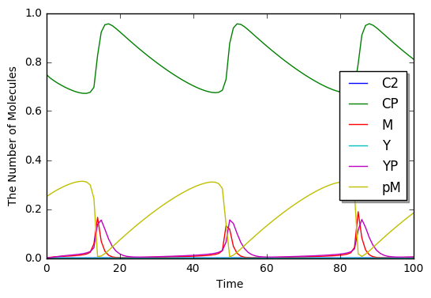

Tyson1991
=========

This model is described in the article:

-  J.J. Tyson, "Modeling the cell division cycle: cdc2 and cyclin
   interactions.", Proc. Natl. Acad. Sci. U.S.A., 88(16), 7328-32, 1991.

Abstract: The proteins cdc2 and cyclin form a heterodimer (maturation
promoting factor) that controls the major events of the cell cycle. A
mathematical model for the interactions of cdc2 and cyclin is
constructed. Simulation and analysis of the model show that the control
system can operate in three modes: as a steady state with high
maturation promoting factor activity, as a spontaneous oscillator, or as
an excitable switch. We associate the steady state with metaphase arrest
in unfertilized eggs, the spontaneous oscillations with rapid division
cycles in early embryos, and the excitable switch with growth-controlled
division cycles typical of nonembryonic cells.

.. code:: ipython2

    %matplotlib inline
    from ecell4 import *

.. code:: ipython2

    with reaction_rules():
        YT = Y + YP + M + pM
        CT = C2 + CP + M + pM
    
        ~Y > Y | 0.015 / CT
        Y > ~Y | 0.0 * Y
        CP + Y > pM | 200.0 * CP * Y / CT
        pM > M | pM * (0.018 + 180 * ((M / CT) ** 2))
        M > pM | 0.0 * M
        M > C2 + YP | 1.0 * M
        YP > ~YP | 0.6 * YP
        C2 > CP | 1000000.0 * C2
        CP > C2 | 1000.0 * CP
    
    m = get_model()

.. code:: ipython2

    for rr in m.reaction_rules():
        print(rr.as_string())

.. parsed-literal::

    C2+CP+M+pM>Y+C2+CP+M+pM|(0.015/(C2+CP+M+pM))
    Y>|(0.0*Y)
    CP+Y+C2+M>pM+C2+M|((200.0*CP*Y)/(C2+CP+M+pM))
    pM+C2+CP>M+C2+CP|(pM*(0.018+(180*pow((M/(C2+CP+M+pM)),2))))
    M>pM|(0.0*M)
    M>C2+YP|(1.0*M)
    YP>|(0.6*YP)
    C2>CP|(1000000.0*C2)
    CP>C2|(1000.0*CP)

.. code:: ipython2

    run_simulation(100.0, model=m, y0={'CP': 0.75, 'pM': 0.25})

