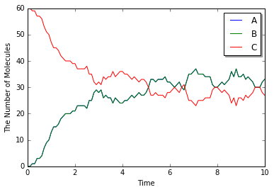
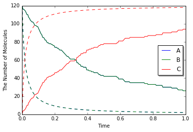
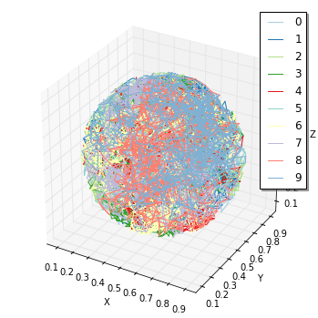

10. Spatiocyte Simulations at Single-Molecule Resolution
========================================================

We showed an example of E-Cell4 spatial representation.
Next let's simulate the models with more detailed spatial representation called "single molecule resolution".

.. code:: python

    %matplotlib inline
    from ecell4 import *

10.1. Spatiocyte Lattice-based Method
-------------------------------------

In spatical Gillespie method, we divided the ``Space`` into smaller
``Space``, then we diffuse the molecules in the subvolumes. However, we
treated the molecules in each subvolume just as the number of the
molecules, and the location of the molecules are NOT determinated.

In other words, the spatical resolution of spatical Gillespie method is
equal to the side of a subvolume :math:`l`. To improve this resolution,
we need to make the size of :math:`l` small. But in this method the
:math:`l` must be larger than the (at least) 10 times the diameter of
molecule :math:`R`.

How can we improve the spatical resolution to the size of the molecule?
The answer is the simulation with single-molecule resolution. This
method simulate the molecule not with the number of the molecules, but
with the spatical reaction diffusion of each molecule.

E-Cell4 has multiple single-molecule resolution method, here we explain
about Spatiocyte lattice-based method. Spatiocyte treats each molecule
as hard spheres, and diffuses the molecules on hexagonal close-packed
lattice.

Spatiocyte has an ID for each molecule and the position of the molecule
with single-molecule resolution. For the higher spatial resolution,
Spatiocyte has 100 times smaller time-step than spatical Gillespie,
because the time scale of diffusion increases with the square of the
distance.

Next, let's try the Spatiocyte method.

.. code:: python

    with species_attributes():
        A | B | C | {'D': '1'}
    
    with reaction_rules():
        A + B == C | (0.01, 0.3)
    
    m = get_model()
    
    w = spatiocyte.SpatiocyteWorld(Real3(1, 1, 1), 0.005)  # The second argument is 'voxel_radius'.
    w.bind_to(m)
    w.add_molecules(Species('C'), 60)
    
    sim = spatiocyte.SpatiocyteSimulator(w)
    obs = FixedIntervalNumberObserver(0.1, ('A', 'B', 'C'))
    sim.run(10, obs)

There is a distinct difference in the second argument for
``SpatiocyteWorld``. This is called ``voxel radius``. Spatiocyte defines
the locations of the molecules with dividing the space with molecule
size, and call the minimum unit for this space as ``Voxel``.

In most cases the size of the molecule would be good for
``voxel radius``. In this example, we set 5 :math:`\mathrm{nm}` as the
radius of the molecule in the space with the side 1
:math:`\mathrm{\mu m}` . It takes more time to simulate, but the result
is same with ODE or Gillespie.

.. code:: python

    viz.plot_number_observer(obs)

10.2. The Diffusion Movement of Single Molecule
-----------------------------------------------

Next let's simulate single molecule diffusion to check the resolution.

.. code:: python

    with species_attributes():
        A | {'D': '1'}
    
    m = get_model()
    
    w = spatiocyte.SpatiocyteWorld(Real3(1, 1, 1), 0.005)
    w.bind_to(m)
    
    (pid, p), suc = w.new_particle(Species('A'), Real3(0.5, 0.5, 0.5))

``new_particle`` method places a particle to a coordinate in
``SpatiocyteWorld``, and returns the particle's ``ParticleID`` (``pid``)
the information about the ``Particle`` (``p``), and verify whether the
particle is cooked with (``suc``). If a particle is already placed in
the coordinate, you can NOT place a particle over it and ``suc`` will be
``False`` and fail.

``p`` contains the particle position, species type, radius, and
diffusion coefficient. You can inspect the ``p`` with the particle's ID,
``pid``.

Let's check ``p`` first.

.. code:: python

    pid, p = w.get_particle(pid)
    print(p.species().serial())  # must print: A
    print(p.radius(), p.D())  # must print: (0.005, 1.0)
    print(tuple(p.position()))  # must print: (0.49806291436591293, 0.49652123150307814, 0.5)

.. parsed-literal::

    A
    (0.005, 1.0)
    (0.49806291436591293, 0.49652123150307814, 0.5)

``get_particle`` method receives a particle ID and returns the ID and
particle (of cource the ID are same with the given one). You can inspect
the coordinate of the particle as ``Real3`` with ``position()`` method.
It is hard to directly read the coordinate, here we printed it after
converting to tuple. As you can see the tuple coodinate is slightly
different from the original position given as a ``Real3``. This is
because Spatiocyte can place the molecule only on the lattice.
``SpatiocyteWorld`` places the molecule a center position of the nearest
lattice for the argument ``Real3``.

You can visualize the coordinate of the molecule with ``viz.plot_world``
method, and check the molecule in the center of the World.

.. code:: python

    viz.plot_world(w, interactive=False)
    # viz.plot_world(w)

.. image:: output_11_0.png

And you can use ``FixedIntervalTrajectoryObserver`` to track the
trajectory of molecular diffusion process.

.. code:: python

    sim = spatiocyte.SpatiocyteSimulator(w)
    obs = FixedIntervalTrajectoryObserver(0.002, (pid,))
    sim.run(1, obs)
    viz.plot_trajectory(obs, interactive=False)
    # viz.plot_trajectory(obs)

.. image:: output_13_0.png

Here we visualized the trajectory with ``viz.plot_trajectory`` method,
you can also obtain it as ``Real3`` list with ``data()`` method.

.. code:: python

    print(len(obs.data()))  # => 1
    print(len(obs.data()[0]))  # => 501

.. parsed-literal::

    1
    501

``data()`` method returns nested list. First index means the index of
the particle. Second index means the index of the ``Real3``. In this
case we threw just one particle, so the first result is ``1``, and next
``501`` means time-series coordinate of the only one particle (initial
coordinate and the coordinates in 1/0.002 = 500 time points).

Also you can obtain the particles in bulk with ``list_particles_exact``
method and a ``Species``.

.. code:: python

    w.add_molecules(Species('A'), 5)
    
    particles = w.list_particles_exact(Species('A'))
    for pid, p in particles:
        print(p.species().serial(), tuple(p.position()))

.. parsed-literal::

    (u'A', (0.9471360338761623, 0.2598076211353316, 0.88))
    (u'A', (0.7756717518813399, 0.964174949546675, 0.06))
    (u'A', (0.5388877434122993, 0.5715767664977295, 1.0))
    (u'A', (0.4164132562731403, 0.7043673284113435, 0.3))
    (u'A', (1.004290794541103, 0.07216878364870322, 0.5750000000000001))
    (u'A', (0.44907311951024936, 0.37527767497325676, 0.32))

Please remember ``list_particles_exact`` method, this method can be used
for other World as well as ``add_molecules`` method.

On a different note, in Spatiocyte proper method to inspect the single
molecule is ``list_voxels_exact``, and the coordinate is described with
index of voxel (not ``Real3``).

10.3 The Diffusion Coefficient and the Second-order Reaction
------------------------------------------------------------

The models we have addressed contains a second-order reaction. Let's
look at the relationship between this second-order reaction and the
diffusion coefficient in Spatiocyte.

.. code:: python

    with species_attributes():
        A | B | C | {'D': '1'}
    
    with reaction_rules():
        A + B > C | 1.0
    
    m = get_model()

.. code:: python

    w = spatiocyte.SpatiocyteWorld(Real3(2, 1, 1), 0.005)
    w.bind_to(m)
    w.add_molecules(Species('A'), 120)
    w.add_molecules(Species('B'), 120)
    
    obs = FixedIntervalNumberObserver(0.005, ('A', 'B', 'C'))
    sim = spatiocyte.SpatiocyteSimulator(w)
    sim.run(1.0, obs)

.. code:: python

    odew = ode.ODEWorld(Real3(2, 1, 1))
    # odew.bind_to(m)
    odew.add_molecules(Species('A'), 120)
    odew.add_molecules(Species('B'), 120)
    
    odeobs = FixedIntervalNumberObserver(0.005, ('A', 'B', 'C'))
    odesim = ode.ODESimulator(m, odew)
    odesim.run(1.0, odeobs)

.. code:: python

    viz.plot_number_observer(obs, "-", odeobs, "--")

Although we used faster kinetic constant than before, the result is
same. But by contrast with ODE simulation, you can find the difference
between them (solid line is ``spatiocyte``, dash line is ``ode``). Is
this fault of Spatiocyte? (No) Actually Spatiocyte reaction rate
couldn't be faster, while ODE reaction rate can be faster infinitely.

This is caused by the difference between the definition of reaction rate
constant in ODE solver and single molecule simulation method. The former
is called "macroscopic" or "effective" reaction rate constant, the
latter is called "microscopic" or "intrinsic" reaction rate constant.

The "macroscopic" rate represents the reaction rate in mixed molecular
state, meanwhile "microscopic" rate represents the reactivity in
molecule collision. So in "microscopic" perspective, the first thing
molecules need to react is collision. In Spatiocyte, however, you make
this "microscopic" rate faster, you can NOT make the actual reaction
rate faster than collision rate. This is called "diffusion-limited"
condition. This is similar to what the molecules coordinated
disproportionately need time to react.

It is known that there is a relationship between this macroscopic rate
constant :math:`k_\mathrm{on}` and microscopic rate constant :math:`k_a`
in 3D space.

:math:`\frac{1}{k_\mathrm{on}}=\frac{1}{k_a}+\frac{1}{4\pi RD_\mathrm{tot}},`

where :math:`R` is the sum of two molecule's radius in collision,
:math:`D_\mathrm{tot}` is the sum of diffusion coefficients.

In the case of the above IPython Notebook cell,
:math:`k_D=4\pi RD_\mathrm{tot}` is almost 0.25 and "microscopic" rate
constant is 1.0. So the "macroscopic" rate constant is almost 0.2.
(However unless you specify the configuration for Spatiocyte, the second
order reaction rate must be slower than :math:`3\sqrt{2} RD`, and the
dissociation constant :math:`k_D` is also :math:`3\sqrt{2} RD`. The
single molecule simulation method can separate molecular "diffusion" and
"reaction" in accurate manner contrary to ODE or Gillespie method
supposed well mixed system (that is diffusion coefficient is infinite).
However if the microscopic rate constant :math:`k_D` is small enough,
the macroscopic rate constant is almost equal to microscopic one
(reaction late-limit).

10.4. The Structure in the Spatiocyte Method
--------------------------------------------

Next we explain a way to create a structure like cell membrane. Although
The structure feature in E-Cell4 is still in development, Spatiocyte
supports the structure on some level. Let's look a sphere structure as
an example.

To restrict the molecular diffusion inside of the sphere, first we
create it.

.. code:: python

    with species_attributes():
        A | {'D': '1', 'location': 'C'}
    
    m = get_model()

.. code:: python

    w = spatiocyte.SpatiocyteWorld(Real3(1, 1, 1), 0.005)
    w.bind_to(m)
    sph = Sphere(Real3(0.5, 0.5, 0.5), 0.45)
    print(w.add_structure(Species('C'), sph))  # will print 539805

.. parsed-literal::

    539805

Visualize the state of the ``World``.

.. code:: python

    viz.plot_world(w, interactive=False)
    # viz.plot_world(w)

.. image:: output_32_0.png

The ``Sphere`` class first argument is the center of the sphere, and
second argument is the radius. Then we created and added a ``Species``
named ``C``. The structure in the Spatiocyte method is described by
filling the space with the ``Voxel``. In the example above, the
``Voxel``\ s in the sphere are occupied with ``Species`` named ``C``.

You can see those distribution with ``viz.plot_world`` as above.
(However, the number of the species is too large to visualize all. So we
plot only a part of it, but actually the sphere is fully occupied with
the ``Species``.)

Next we create Species moving inside this sphere. To that end we give
``location`` attribute to the ``Species``. After that, you just throw-in
molecules to the ``World`` with ``add_molecules`` function.

.. code:: python

    w.add_molecules(Species('A'), 120)

.. code:: python

    viz.plot_world(w, species_list=('A',), interactive=False)  # visualize A-molecules only
    # viz.plot_world(w, species_list=('A',))  # visualize A-molecules only

.. image:: output_35_0.png

Now we restricted the trajectories of ``Species`` ``A`` on the structure
of Species ``C``, and ``add_molecules`` works like that. As a note, you
need to create the structure before ``add_molecule``.

We can use ``FixedIntervalTrajectoryObserver`` to check the restriction
of the diffusion area.

.. code:: python

    pid_list = [pid for pid, p in w.list_particles(Species('A'))[: 10]]
    obs = FixedIntervalTrajectoryObserver(1e-3, pid_list)
    sim = spatiocyte.SpatiocyteSimulator(w)
    sim.run(1, obs)
    viz.plot_trajectory(obs, interactive=False)
    # viz.plot_trajectory(obs)

``pid_list`` is a list of the first 10 ``ParticleID``\ s of ``A``
molecules. The trajectories are colored by this 10 species. Certainly
the trajectories are restricted in the sphere.

10.5 The structure and the reaction
-----------------------------------

At the end, we explain about molecular translocation among the
structures.

A ``Species`` without ``location`` attribute is not an member of any
structures. In the example above, if you do NOT write ``location``
attribute with Species ``A``, ``A`` is placed outside of the sphere.

Next let's create a planar surface structure. To create a surface, we
need to use three Real3, those are original point (``origin``) and two
axis vector (``unit0``, ``unit1``):
``ps = PlanarSurface(origin, unit0, unit1)``.

Suppose Species ``A`` on the surface, ``ps``, and a normal Species
``B``.

.. code:: python

    with species_attributes():
        A | {'D': '0.1', 'location': 'M'}
        B | {'D': '1'}
    
    m  = get_model()
    
    w = spatiocyte.SpatiocyteWorld(Real3(1, 1, 1))
    w.bind_to(m)
    
    origin = Real3(0, 0, 0.5)
    unit0 = Real3(1, 0, 0)
    unit1 = Real3(0, 1, 0)
    w.add_structure(
        Species('M'), PlanarSurface(origin, unit0, unit1))  # Create a structure first
    
    w.add_molecules(Species('B'), 480)  # Throw-in B-molecules

.. code:: python

    viz.plot_world(w, species_list=('B', 'M'), interactive=False)
    # viz.plot_world(w, species_list=('B', 'M'))

.. image:: output_41_0.png

It might be hard to see them, but actually the ``Species`` ``B`` are
placed only not on a surface. Then how can we make absorbed this
``Species`` ``B`` to a surface ``M`` and synthesize a ``Species`` ``A``.

.. code:: python

    with species_attributes():
        A | {'D': '0.1', 'location': 'M'}
        B | {'D': '1'}
    
    with reaction_rules():
        B + M == A | (1.0, 1.5)
    
    m = get_model()

This means that a ``Species`` ``B`` becomes ``A`` when ``B`` collides
with a structure ``M``. On the other hand, a species ``A`` dissociates
from the structure, and becomes ``M`` and ``B`` on as the reverse
reaction direction.

Now you can simulate this model with a structure.

.. code:: python

    w.bind_to(m)
    
    sim = spatiocyte.SpatiocyteSimulator(w)
    obs = NumberObserver(('A', 'B'))
    sim.run(2, obs)

.. code:: python

    viz.plot_number_observer(obs)
    viz.plot_world(w, species_list=('A', 'B'), interactive=False)
    # viz.plot_world(w, species_list=('A', 'B'))

.. image:: output_46_0.png

.. image:: output_46_1.png

In the dissociation from a structure, you can skip to write the
structure. Thus, ``A > B`` just means the same as ``A > B + M`` in the
above. But in the binding, you can **NOT**. Because it is impossible to
create ``A`` from ``B`` with no ``M`` around there. By contrast the
species ``A`` wherever on the sphere ``M`` can create the species ``B``.
The first order reaction occurs in either presence or absence of the
structure. But, in the case of the binding, the second order reaction
turns into the first order reaction and the meaning of rate constant
also changes if you ignore ``M`` in the left-hand side.

