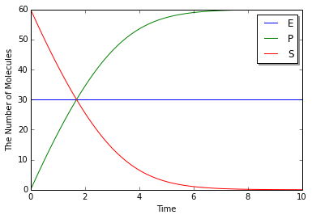
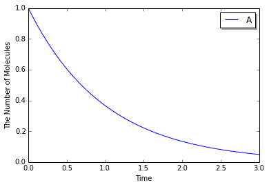

6. How to Solve ODEs with Rate Law Functions
============================================

Although the ``ode`` solver accepts ``NetworkModel``,
``ode.ODESimulator`` owns its model class ``ode.ODENetworkModel`` and
``ode.ODEReactionRule`` for the extension. The interface of these
classes are almost same with ``Model`` classes and ``ReactionRule``.
Here, we explain the usage specific to ``ode`` especially about
``ode.ODERatelaw``.

.. code:: python

    %matplotlib inline
    from ecell4 import *

However, the rate law support in ``ode`` is under development. Some
functions might be deprecated in the future. Currently, to enable rate
laws, the option ``ecell4.util.decorator.ENABLE_RATELAW`` must be
activated as follows:

.. code:: python

    util.decorator.ENABLE_RATELAW = True

6.1. ode.ODEReactionRule
------------------------

``ode.ODEReactionRule`` has almost same members with ``ReactionRule``.

.. code:: python

    rr1 = ReactionRule()
    rr1.add_reactant(Species("A"))
    rr1.add_reactant(Species("B"))
    rr1.add_product(Species("C"))
    rr1.set_k(1.0)
    print(len(rr1.reactants()))  # => 2
    print(len(rr1.products()))  # => 1
    print(rr1.k())  # => 1.0
    print(rr1.as_string())  # => A+B>C|1

.. parsed-literal::

    2
    1
    1.0
    A+B>C|1

.. code:: python

    rr2 = ode.ODEReactionRule()
    rr2.add_reactant(Species("A"))
    rr2.add_reactant(Species("B"))
    rr2.add_product(Species("C"))
    rr2.set_k(1.0)
    print(len(rr2.reactants()))  # => 2
    print(len(rr2.products()))  # => 1
    print(rr2.k())  # => 1.0
    print(rr2.as_string())  # => A+B>C|1

.. parsed-literal::

    2
    1
    1.0
    A+B>C|1

In addition to the common members, ``ode.ODEReactionRule`` can store
stoichiometric coefficients for each ``Species``:

.. code:: python

    rr2 = ode.ODEReactionRule()
    rr2.add_reactant(Species("A"), 1.0)
    rr2.add_reactant(Species("B"), 2.0)
    rr2.add_product(Species("C"), 2.5)
    rr2.set_k(1.0)
    print(rr2.as_string())

.. parsed-literal::

    A+2*B>2.5*C|1

You can also access to the coefficients as follows:

.. code:: python

    print(rr2.reactants_coefficients())  # => [1.0, 2.0]
    print(rr2.products_coefficients())  # => [2.5]

.. parsed-literal::

    [1.0, 2.0]
    [2.5]

6.2. ode.ODERatelaw
-------------------

``ode.ODEReactionRule`` can be bound to a ``ode.ODERatelaw``.
``ode.ODERatelaw`` provides a function to calculate a derivative (flux
or velocity) based on the given values of ``Species``.
``ode.ODERatelawMassAction`` is a default class bound to
``ode.ODEReactionRule``.

.. code:: python

    rr1 = ode.ODEReactionRule()
    rr1.add_reactant(Species("A"))
    rr1.add_reactant(Species("B"))
    rr1.add_product(Species("C"))
    rl1 = ode.ODERatelawMassAction(2.0)
    rr1.set_ratelaw(rl1)  # equivalent to rr1.set_k(2.0)
    print(rr1.as_string())

.. parsed-literal::

    A+B>C|2

``ode.ODERatelawCallback`` enables the user-defined function for
calculating a flux.

.. code:: python

    def mass_action(reactants, products, volume, t, rr):
        veloc = 2.0 * volume
        for value in reactants:
            veloc *= value / volume
        return veloc
    
    rl2 = ode.ODERatelawCallback(mass_action)
    rr1.set_ratelaw(rl2)
    print(rr1.as_string())

.. parsed-literal::

    A+B>C|mass_action

The function bound must accept five arguments and return a floating
number as a velocity. The first and second list contain a value for each
reactants and products respectively. When you need to access the
stoichiometric coefficients, use ``rr`` (``ode.ODEReactionRule``) in the
arguments.

A ``lambda`` function is available too.

.. code:: python

    rl2 = ode.ODERatelawCallback(lambda r, p, v, t, rr: 2.0 * r[0] * r[1])
    rr1.set_k(0)
    rr1.set_ratelaw(rl2)
    print(rr1.as_string())

.. parsed-literal::

    A+B>C|<lambda>

6.3. ode.ODENetworkModel
------------------------

``ode.ODENetworkModel`` accepts both ``ReactionRule`` and
``ode.ODEReactionRule``. ``ReactionRule`` is implicitly converted and
stored as a ``ode.ODEReactionRule``.

.. code:: python

    m1 = ode.ODENetworkModel()
    rr1 = create_unbinding_reaction_rule(Species("C"), Species("A"), Species("B"), 3.0)
    m1.add_reaction_rule(rr1)
    rr2 = ode.ODEReactionRule(create_binding_reaction_rule(Species("A"), Species("B"), Species("C"), 0.0))
    rr2.set_ratelaw(ode.ODERatelawCallback(lambda r, p, v, t, rr: 0.1 * r[0] * r[1]))
    m1.add_reaction_rule(rr2)

You can access to the list of ``ode.ODEReactionRule``\ s in
``ode.ODENetworkModel`` via its member ``reaction_rules()``.

.. code:: python

    print([rr.as_string() for rr in m1.reaction_rules()])

.. parsed-literal::

    [u'C>A+B|3', u'A+B>C|<lambda>']

Finally, you can run simulations in the same way with other solvers as
follows:

.. code:: python

    run_simulation(1.0, model=m1, y0={'A': 60, 'B': 60})

.. image:: output_22_0.png

Modeling with Python decorators is also available by specifying a
function instead of a rate (floating number). When a floating number is
set, it is assumed to be a kinetic rate of a mass action reaction, but
not a constant velocity.

.. code:: python

    with reaction_rules():
        A + B == C | (lambda r, *args: 0.1 * reduce(mul, r), 3.0)
    
    m1 = get_model()

For the simplicity, you can directory defining the equation with
``Species`` names as follows:

.. code:: python

    with reaction_rules():
        A + B == C | (0.1 * A * B, 3.0)
    
    m1 = get_model()

When you call a ``Species`` unlisted as a reactant or product, it is
automatically added to the list as an enzyme.

.. code:: python

    with reaction_rules():
        S > P | 1.0 * E * S / (30.0 + S)
    
    m1 = get_model()
    print(m1.reaction_rules()[0].as_string())

.. parsed-literal::

    S+E>P+E|((1.0*E*S)/(30.0+S))

where ``E`` in the equation is appended to both reacant and product
lists.

.. code:: python

    run_simulation(10.0, model=m1, y0={'S': 60, 'E': 30})

Please be careful about typo in ``Species``' name. When you make a typo,
it might be recognized as a new enzyme with no attention:

.. code:: python

    with reaction_rules():
        A13P2G > A23P2G | 1500 * A13B2G  # typo: A13P2G -> A13B2G
    
    m1 = get_model()
    print(m1.reaction_rules()[0].as_string())

.. parsed-literal::

    A13P2G+A13B2G>A23P2G+A13B2G|(1500*A13B2G)

When you want to avoid the automatic declaration of enzymes, inactivate
``util.decorator.ENABLE_IMPLICIT_DECLARATION``. If its value is
``False``, the above case will raise an error:

.. code:: python

    util.decorator.ENABLE_IMPLICIT_DECLARATION = False
    
    try:
        with reaction_rules():
            A13P2G > A23P2G | 1500 * A13B2G
    except RuntimeError, e:
        print(repr(e))
    
    util.decorator.ENABLE_IMPLICIT_DECLARATION = True

.. parsed-literal::

    RuntimeError('unknown variable [A13B2G] was used.',)

Although E-Cell4 is specialized for a simulation of biochemical reaction
network, by using a synthetic reaction rule, ordinary differential
equations can be translated intuitively. For example, the Lotka-Volterra
equations:

.. math:: \frac{dx}{dt} = Ax - Bxy\\\frac{dy}{dt} = -Cx + Dxy

where :math:`A=1.5, B=1, C=3, D=1, x(0)=10, y(0)=5`, are solved as
follows:

.. code:: python

    with reaction_rules():
        A, B, C, D = 1.5, 1, 3, 1
    
        ~x > x | A * x - B * x * y
        ~y > y | -C * y + D * x * y
    
    run_simulation(10, model=get_model(), y0={'x': 10, 'y': 5})

.. image:: output_36_0.png

6.4. References in a Rate Law
-----------------------------

Here, we exlain the details in the rate law definition.

First, when you use simpler definitions of a rate law with ``Species``,
only a limited number of mathematical functions (i.g. ``exp``, ``log``,
``sin``, ``cos``, ``tan``, ``asin``, ``acos``, ``atan``, and ``pi``) are
available there even if you declare the function outside the block.

.. code:: python

    try:
        from math import erf
    
        with reaction_rules():
            S > P | erf(S / 30.0)
    except TypeError, e:
        print(repr(e))

.. parsed-literal::

    TypeError('a float is required',)

This is because ``erf`` is tried to be evaluated agaist ``S / 30.0``
first, but it is not a floating number. In contrast, the following case
is acceptable:

.. code:: python

    from math import erf
    
    with reaction_rules():
        S > P | erf(2.0) * S
    
    m1 = get_model()
    print(m1.reaction_rules()[0].as_string())

.. parsed-literal::

    S>P|(0.995322265019*S)

where only the result of ``erf(2.0)``, ``0.995322265019``, is passed to
the rate law. Thus, the rate law above has no reference to the ``erf``
function. Similarly, a value of variables declared outside is
acceptable, but not as a reference.

.. code:: python

    kcat, Km = 1.0, 30.0
    
    with reaction_rules():
        S > P | kcat * E * S / (Km + S)
    
    m1 = get_model()
    print(m1.reaction_rules()[0].as_string())
    kcat = 2.0
    print(m1.reaction_rules()[0].as_string())

.. parsed-literal::

    S+E>P+E|((1.0*E*S)/(30.0+S))
    S+E>P+E|((1.0*E*S)/(30.0+S))

Even if you change the value of a variable, it does **not** affect the
rate law.

On the other hand, when you use your own function to define a rate law,
it can hold a reference to variables outside.

.. code:: python

    k1 = 1.0
    
    with reaction_rules():
        S > P | (lambda r, *args: k1 * r[0])  # referring k1
    
    m1 = get_model()
    
    obs1 = run_simulation(2, model=m1, y0={"S": 60}, return_type='observer')
    k1 = 2.0
    obs2 = run_simulation(2, model=m1, y0={"S": 60}, return_type='observer')
    
    viz.plot_number_observer(obs1, '-', obs2, '--')

.. image:: output_44_0.png

However, in this case, it is better to make a new model for each set of
parameters.

.. code:: python

    def create_model(k):
        with reaction_rules():
            S > P | k
    
        return get_model()
    
    obs1 = run_simulation(2, model=create_model(k=1.0), y0={"S": 60}, return_type='observer')
    obs2 = run_simulation(2, model=create_model(k=2.0), y0={"S": 60}, return_type='observer')
    # viz.plot_number_observer(obs1, '-', obs2, '--')

6.5. More about ode
-------------------

In ``ode.ODEWorld``, a value for each ``Species`` is a floating number.
However, for the compatibility, the common member ``num_molecules`` and
``add_molecules`` regard the value as an integer.

.. code:: python

    w = ode.ODEWorld()
    w.add_molecules(Species("A"), 2.5)
    print(w.num_molecules(Species("A")))

.. parsed-literal::

    2

To set/get a real number, use ``set_value`` and ``get_value``:

.. code:: python

    w.set_value(Species("B"), 2.5)
    print(w.get_value(Species("A")))
    print(w.get_value(Species("B")))

.. parsed-literal::

    2.0
    2.5

As a default, ``ode.ODESimulator`` employs the Rosenblock method, called
``ROSENBROCK4_CONTROLLER``, to solve ODEs. In addition to that, two
solvers, ``EULER`` and ``RUNGE_KUTTA_CASH_KARP54``, are available.
``ROSENBROCK4_CONTROLLER`` and ``RUNGE_KUTTA_CASH_KARP54`` adaptively
change the step size during time evolution due to error controll, but
``EULER`` does not.

.. code:: python

    with reaction_rules():
        A > ~A | 1.0
    
    m1 = get_model()
    
    w1 = ode.ODEWorld()
    w1.set_value(Species("A"), 1.0)
    sim1 = ode.ODESimulator(m1, w1, ode.EULER)
    sim1.set_dt(0.01) # This is only effective for EULER
    sim1.run(3.0, obs1)

``ode.ODEFactory`` also accepts a solver type and a default step
interval.

.. code:: python

    run_simulation(3.0, model=m1, y0={"A": 1.0}, factory=ode.ODEFactory(ode.EULER, 0.01))

See also examples listed below:

-  :doc:`../Glycolysis/Glycolysis`
-  :doc:`../Drosophila/Drosophila`
-  :doc:`../Attractors/Attractors`
