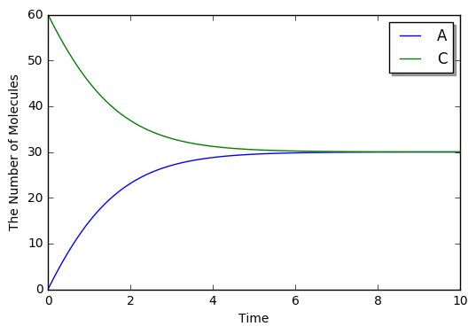
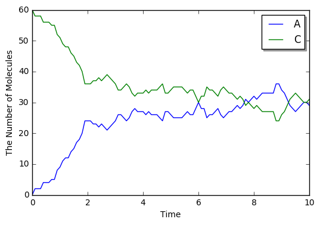

8. More about 1. Brief Tour of E-Cell4 Simulations
==================================================

Once you read through `1. Brief Tour of E-Cell4
Simulations <1.%20Brief%20Tour%20of%20E-Cell4%20Simulations>`__, it is
NOT difficult to use ``World`` and ``Simulator``. ``volume`` and
``{'C': 60}`` is equivalent of the ``World`` and solver is the
``Simulator`` below.

.. code:: ipython2

    %matplotlib inline
    from ecell4 import *
    
    with reaction_rules():
        A + B == C | (0.01, 0.3)
    
    y = run_simulation(10.0, {'C': 60}, volume=1.0)

.. image:: tutorial8_files/tutorial8_1_0.png

Here we give you a breakdown for ``run_simulation``. ``run_simulation``
use ODE simulator by default, so we create ``ODEWorld`` step by step.

Creating ODEWorld
-----------------

You can create ``World`` like this.

.. code:: ipython2

    w = ode.ODEWorld(Real3(1, 1, 1))

``Real3`` is a coordinate vector. In this example, the first argument
for ``ODEWorld`` constructor is a cube. Note that you can NOT use volume
for ``ode.ODEWorld`` argument, like ``run_simulation`` argument.

Now you created a cube box for simulation, next let's throw molecules
into the cube.

.. code:: ipython2

    w = ode.ODEWorld(Real3(1, 1, 1))
    w.add_molecules(Species('C'), 60)
    print(w.t(), w.num_molecules(Species('C')))  # must return (0.0, 60)

.. parsed-literal::

    0.0 60

Use ``add_molecules`` to add molecules, ``remove_molecules`` to remove
molecules, ``num_molecules`` to know the number of molecules. First
argument for each method is the ``Species`` you want to know. You can
get current time by ``t`` method. However the number of molecules in ODE
solver is real number, in these ``_molecules`` functions work only for
integer number. When you handle real numbers in ODE, use ``set_value``
and ``get_value``.

How to Use Real3
----------------

Before the detail of ``Simulator``, we explaing more about ``Real3``.

.. code:: ipython2

    pos = Real3(1, 2, 3)
    print(pos)  # must print like <ecell4.core.Real3 object at 0x7f44e118b9c0>
    print(tuple(pos))  # must print (1.0, 2.0, 3.0)

.. parsed-literal::

    <ecell4.core.Real3 object at 0x7f712f1c6af8>
    (1.0, 2.0, 3.0)

You can not print the contents in ``Real3`` object directly. You need to
convert ``Real3`` to Python tuple or list once.

.. code:: ipython2

    pos1 = Real3(1, 1, 1)
    x, y, z = pos[0], pos[1], pos[2]
    pos2 = pos1 + pos1
    pos3 = pos1 * 3
    pos4 = pos1 / 5
    print(length(pos1))  # must print 1.73205080757
    print(dot_product(pos1, pos3))  # must print 9.0

.. parsed-literal::

    1.7320508075688772
    9.0

You can use basic function like ``dot_product``. Of course, you can
convert ``Real3`` to numpy array too.

.. code:: ipython2

    import numpy
    a = numpy.asarray(tuple(Real3(1, 2, 3)))
    print(a)  # must print [ 1.  2.  3.]

.. parsed-literal::

    [ 1.  2.  3.]

``Integer3`` represents a triplet of integers.

.. code:: ipython2

    g = Integer3(1, 2, 3)
    print(tuple(g))

.. parsed-literal::

    (1, 2, 3)

Of course, you can also apply simple arithmetics to ``Integer3``.

.. code:: ipython2

    print(tuple(Integer3(1, 2, 3) + Integer3(4, 5, 6)))  # => (5, 7, 9)
    print(tuple(Integer3(4, 5, 6) - Integer3(1, 2, 3)))  # => (3, 3, 3)
    print(tuple(Integer3(1, 2, 3) * 2))  # => (2, 4, 6)
    print(dot_product(Integer3(1, 2, 3), Integer3(4, 5, 6)))  # => 32
    print(length(Integer3(1, 2, 3)))  # => 3.74165738677

.. parsed-literal::

    (5, 7, 9)
    (3, 3, 3)
    (2, 4, 6)
    32
    3.7416573867739413

Creating and Running ODESimulator
---------------------------------

You can create a ``Simulator`` with ``Model`` and ``World`` like

.. code:: ipython2

    with reaction_rules():
        A + B > C | 0.01  # equivalent to create_binding_reaction_rule
        C > A + B | 0.3   # equivalent to create_unbinding_reaction_rule
    
    m = get_model()
    
    sim = ode.ODESimulator(m, w)
    sim.run(10.0)

then call ``run`` method, the simulation will run. In this example the
simulation runs for 10seconds.

You can check the state of the ``World`` like this.

.. code:: ipython2

    print(w.t(), w.num_molecules(Species('C')))  # must return (10.0, 30)

.. parsed-literal::

    10.0 30

You can see that the number of the ``Species`` ``C`` decreases from 60
to 30.

``World`` describes the state of a timepoint, so you can NOT see the
transition of the simulation with the ``World``. To obtain the
time-series result, use ``Observer``.

.. code:: ipython2

    w = ode.ODEWorld(Real3(1, 1, 1))
    w.add_molecules(Species('C'), 60)
    sim = ode.ODESimulator(m, w)
    
    obs = FixedIntervalNumberObserver(0.1, ('A', 'C'))
    sim.run(10.0, obs)
    print(obs.data())  # must return [[0.0, 0.0, 60.0], ..., [10.0, 29.994446899691276, 30.005553100308752]]

.. parsed-literal::

    [[0.0, 0.0, 60.0], [0.1, 1.7722206142399386, 58.22777938576007], [0.2, 3.4860124973550763, 56.513987502644945], [0.30000000000000004, 5.1376332940411835, 54.86236670595884], [0.4, 6.7240908311569765, 53.27590916884304], [0.5, 8.243129777354657, 51.756870222645354], [0.6000000000000001, 9.693203786345993, 50.30679621365402], [0.7000000000000001, 11.073435609634762, 48.92656439036526], [0.8, 12.383567709304009, 47.61643229069602], [0.9, 13.62390593330331, 46.376094066696716], [1.0, 14.795258696956067, 45.20474130304395], [1.1, 15.898873914927304, 44.101126085072714], [1.2000000000000002, 16.936375647980476, 43.06362435201953], [1.3, 17.90970212636381, 42.090297873636196], [1.4000000000000001, 18.82104647943906, 41.17895352056095], [1.5, 19.672801193207913, 40.32719880679208], [1.6, 20.467507009937687, 39.5324929900623], [1.7000000000000002, 21.207806725565728, 38.79219327443426], [1.8, 21.89640410475561, 38.10359589524438], [1.9000000000000001, 22.53602794919405, 37.46397205080594], [2.0, 23.12940119511786, 36.870598804882135], [2.1, 23.679214809238708, 36.32078519076129], [2.2, 24.188106165089213, 35.81189383491079], [2.3000000000000003, 24.658641529612783, 35.34135847038722], [2.4000000000000004, 25.093302258995163, 34.90669774100484], [2.5, 25.49447429493352, 34.50552570506648], [2.6, 25.8644405527028, 34.13555944729721], [2.7, 26.205375811329684, 33.794624188670326], [2.8000000000000003, 26.519343738988976, 33.480656261011035], [2.9000000000000004, 26.808295711974996, 33.191704288025015], [3.0, 27.074071121124312, 32.925928878875695], [3.1, 27.318398888613753, 32.68160111138626], [3.2, 27.542899952449396, 32.45710004755061], [3.3000000000000003, 27.749090504239874, 32.25090949576014], [3.4000000000000004, 27.9383857991408, 32.06161420085921], [3.5, 28.11210437761627, 31.887895622383745], [3.6, 28.271472570201077, 31.728527429798937], [3.7, 28.417629171947233, 31.58237082805278], [3.8000000000000003, 28.551630198016127, 31.448369801983887], [3.9000000000000004, 28.67445364398628, 31.325546356013735], [4.0, 28.78700419289561, 31.212995807104406], [4.1000000000000005, 28.890117822924406, 31.109882177075608], [4.2, 28.984566278368252, 31.015433721631762], [4.3, 29.071061378116323, 30.92893862188369], [4.4, 29.1502591428144, 30.849740857185616], [4.5, 29.222763727009596, 30.777236272990418], [4.6000000000000005, 29.289131149587988, 30.710868850412027], [4.7, 29.349872818077007, 30.650127181923008], [4.800000000000001, 29.405458847718158, 30.594541152281856], [4.9, 29.45632117740186, 30.543678822598153], [5.0, 29.50285648685389, 30.497143513146124], [5.1000000000000005, 29.545428921882756, 30.454571078117258], [5.2, 29.584372634401596, 30.415627365598418], [5.300000000000001, 29.619994145547814, 30.3800058544522], [5.4, 29.652574540659273, 30.34742545934074], [5.5, 29.68237150474733, 30.317628495252684], [5.6000000000000005, 29.70962120776119, 30.290378792238823], [5.7, 29.734540048185814, 30.2654599518142], [5.800000000000001, 29.757326264269658, 30.242673735730357], [5.9, 29.778161421222734, 30.22183857877728], [6.0, 29.797211782629706, 30.20278821737031], [6.1000000000000005, 29.814629574377268, 30.185370425622747], [6.2, 29.830554148226415, 30.1694458517736], [6.300000000000001, 29.845113052611232, 30.154886947388782], [6.4, 29.858423017395136, 30.141576982604878], [6.5, 29.870590858842306, 30.12940914115771], [6.6000000000000005, 29.88171431109604, 30.118285688903974], [6.7, 29.891882789565617, 30.108117210434397], [6.800000000000001, 29.90117809164052, 30.098821908359493], [6.9, 29.90967503957614, 30.090324960423875], [7.0, 29.917442070185807, 30.082557929814207], [7.1000000000000005, 29.92454177545741, 30.075458224542604], [7.2, 29.931031398180217, 30.068968601819797], [7.300000000000001, 29.936963286068657, 30.063036713931357], [7.4, 29.942385307865454, 30.05761469213456], [7.5, 29.947341234505906, 30.052658765494108], [7.6000000000000005, 29.951871088124744, 30.04812891187527], [7.7, 29.956011461686572, 30.043988538313442], [7.800000000000001, 29.95979581159447, 30.040204188405543], [7.9, 29.963254725495695, 30.03674527450432], [8.0, 29.966416167427376, 30.03358383257264], [8.1, 29.969305702153324, 30.03069429784669], [8.200000000000001, 29.971946700401624, 30.02805329959839], [8.3, 29.974360526683636, 30.025639473316378], [8.4, 29.976566711086004, 30.02343328891401], [8.5, 29.97858310644787, 30.021416893552143], [8.6, 29.980426032104244, 30.01957396789577], [8.700000000000001, 29.982110405367983, 30.01788959463203], [8.8, 29.983649861781593, 30.01635013821842], [8.9, 29.985056865082736, 30.014943134917278], [9.0, 29.98634280776668, 30.013657192233335], [9.1, 29.987518103037754, 30.01248189696226], [9.200000000000001, 29.988592268895058, 30.011407731104956], [9.3, 29.98957400500265, 30.010425994997366], [9.4, 29.99047126298592, 30.009528737014094], [9.5, 29.991291310690197, 30.008708689309817], [9.600000000000001, 29.99204079093546, 30.007959209064555], [9.700000000000001, 29.992725775226692, 30.007274224773322], [9.8, 29.993351812853714, 30.0066481871463], [9.9, 29.993923975784767, 30.006076024215247], [10.0, 29.99444689969606, 30.005553100303953]]

There are several types of ``Observer``\ s for E-Cell4.
``FixedIntervalNumberObserver`` is the simplest ``Observer`` to obtain
the time-series result. As its name suggests, this ``Observer`` records
the number of molecules for each time-step. The 1st argument is the
time-step, the 2nd argument is the molecule types. You can check the
result with ``data`` method, but there is a shortcut for this.

.. code:: ipython2

    viz.plot_number_observer(obs)

This plots the time-series result easily.

We explained the internal of ``run_simulation`` function. When you
change the ``World`` after creating the ``Simulator``, you need to
indicate it to ``Simulator``. So do NOT forget to call
``sim.initialize()`` after that.

Switching the Solver
--------------------

It is NOT difficult to switch the solver to stochastic method, as we
showed ``run_simulation``.

.. code:: ipython2

    from ecell4 import *
    
    with reaction_rules():
        A + B == C | (0.01, 0.3)
    
    m = get_model()
    
    # ode.ODEWorld -> gillespie.GillespieWorld
    w = gillespie.GillespieWorld(Real3(1, 1, 1))
    w.add_molecules(Species('C'), 60)
    
    # ode.ODESimulator -> gillespie.GillespieSimulator
    sim = gillespie.GillespieSimulator(m, w)
    obs = FixedIntervalNumberObserver(0.1, ('A', 'C'))
    sim.run(10.0, obs)
    
    viz.plot_number_observer(obs)

``World`` and ``Simulator`` never change the ``Model`` itself, so you
can switch several ``Simulator``\ s for 1 ``Model``.
